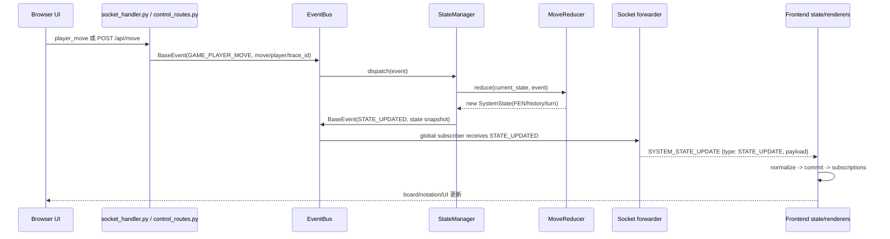
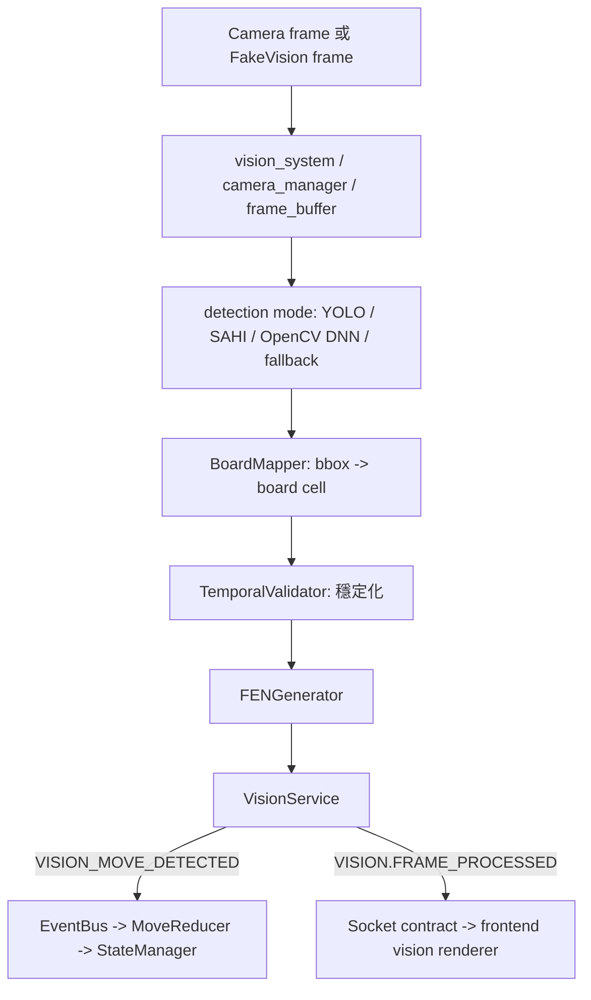
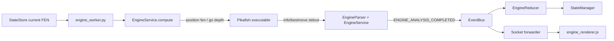
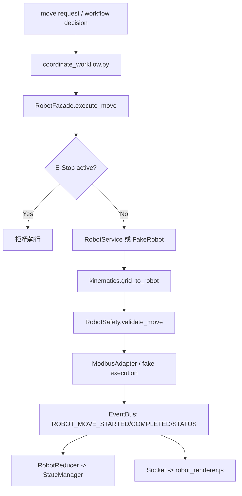
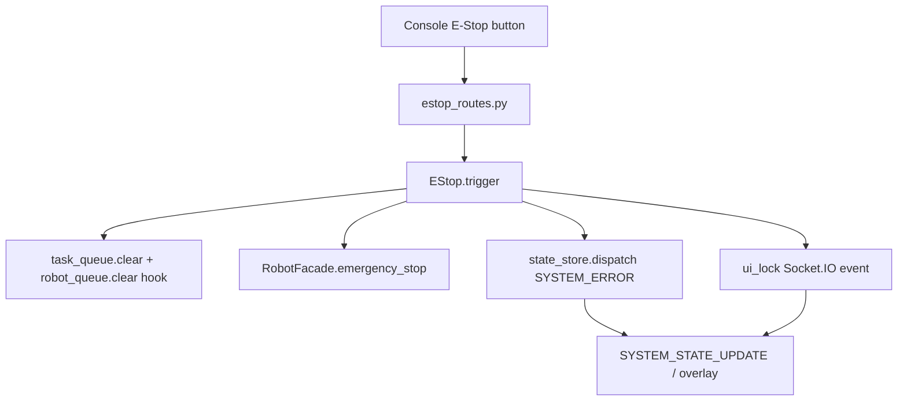
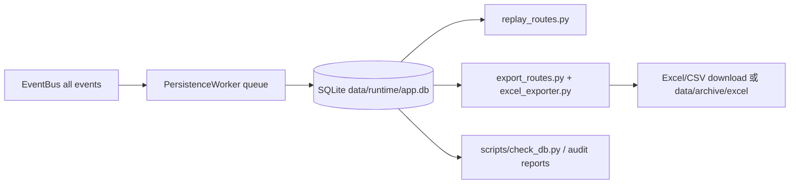

# 第二份：資料流程、傳遞方向與系統圖

更新日期：2026-05-17

本文件說明目前專案中各檔案群如何交換資料、資料從哪裡來、傳給誰，以及前後端/engine/vision/robot/database 的主要流向。第一份文件負責逐檔清單；這份文件把那些檔案放回實際執行流程中理解。

## 1. 全系統資料流總圖

```mermaid
flowchart LR
    User[操作者/玩家] -->|點擊 UI、登入、控制、走子| Browser[frontend templates + JS modules]
    Browser -->|REST JSON| API[backend/interfaces/api/*]
    Browser -->|Socket.IO player_move/action| WS[backend/interfaces/websocket/socket_handler.py]
    Browser -->|MJPEG GET /api/video_feed| VisionStream[vision_routes.py + vision_system.get_video_stream]

    API -->|BaseEvent| Bus[backend/events/bus/event_bus.py]
    WS -->|BaseEvent| Bus

    Bus -->|dispatch all events| StateManager[backend/state/store/manager/state_manager.py]
    StateManager -->|ReducerRegistry| Reducers[backend/state/reducers/*]
    Reducers -->|new SystemState| StateManager
    StateManager -->|STATE_UPDATED| Bus

    Bus -->|forward contract events| WS
    WS -->|SYSTEM_STATE_UPDATE| BrowserState[frontend websocket/event_adapter.js + state/normalizer.js + state_manager.js]
    BrowserState -->|subscriptions| Renderers[frontend board/core/ui renderers]
    Renderers -->|DOM update| Browser

    Camera[Camera/FakeVision] --> VisionSystem[backend/infrastructure/vision/*]
    VisionSystem -->|detections/FEN| VisionService[backend/application/services/vision_service.py]
    VisionService -->|VISION_MOVE_DETECTED / VISION.FRAME_PROCESSED| Bus

    StateManager -->|current FEN| EngineWorker[backend/runtime/workers/engine_worker.py]
    EngineWorker -->|compute(fen)| EngineService[backend/application/services/engine_service.py]
    EngineService -->|UCI stdin/stdout| Pikafish[protected_assets/engine]
    EngineService -->|ENGINE_ANALYSIS_COMPLETED| Bus

    Bus -->|move/engine events| Workflow[backend/application/use_cases/coordinate_workflow.py]
    Workflow -->|execute_move| RobotFacade[backend/application/services/robot_facade.py]
    RobotFacade -->|real/mock| RobotService[robot_service.py / fake_robot.py]
    RobotService -->|ROBOT events/status| Bus

    Bus -->|all events| Persistence[backend/runtime/workers/persistence_worker.py]
    Persistence -->|batch insert| SQLite[data/runtime/app.db]
    SQLite -->|read| ReplayExport[replay_routes.py / export_routes.py / excel_exporter.py]
```

## 2. 檔案群資料傳遞矩陣

| 檔案群 | 接收來源 | 傳遞資料 | 接收對象 |
| --- | --- | --- | --- |
| `main.py` | 使用者執行 Python | host/port/debug/env config | `backend.main.create_app()`、Flask-SocketIO server |
| `backend/main.py` | `main.py` | Flask app、Socket.IO、security headers、blueprints | Browser、`backend.interfaces.api.*`、`socket_handler.py` |
| `backend/application/bootstrap.py` | `create_app()` | runtime、container services、reducers、workers、workflow | `container.py`、`EventBus`、`StateManager`、workers |
| `backend/application/container.py` | bootstrap 註冊 | `bus`、`runtime`、`state`、`engine`、`vision`、`robot` | API routes、workers、services、workflow |
| `backend/interfaces/api/*` | Browser REST request | JSON request、JWT claims、idempotency key、BaseEvent | `EventBus`、service/container、HTTP response |
| `backend/interfaces/websocket/*` | Browser Socket.IO | auth token、`player_move`、`vision_update`、`action`、contract payload | `EventBus`、frontend `SYSTEM_STATE_UPDATE` |
| `backend/events/*` | API、Socket、services、workers、state | `BaseEvent`、event type、trace_id、payload | StateManager、workers、persistence、socket forwarder |
| `backend/state/store/*` | EventBus events | canonical `SystemState`、state snapshot、FEN validation | `STATE_UPDATED` event、API `/api/state`、EngineWorker |
| `backend/state/reducers/*` | StateManager | event payload -> immutable state mutation | StateManager commit |
| `backend/runtime/*` | bootstrap/container | background loop、worker status、queues、contract schema | workers、Socket contract、diagnostics API |
| `backend/runtime/workers/*` | state、queues、services、EventBus | engine analysis、robot status、monitoring、persistence batch | EventBus、SQLite、frontend diagnostics |
| `backend/application/services/*` | workers/API/EventBus/workflow | engine result、vision FEN、robot action/status、runtime control | EventBus、hardware/fake adapters、API response |
| `backend/application/use_cases/*` | EventBus and state | workflow decision、apply move、strategy analysis | EngineService、RobotFacade、EventBus |
| `backend/infrastructure/vision/*` | camera/model/fake stream | frame、detections、board_state、FEN、MJPEG frame | VisionService、vision routes、frontend video/overlay |
| `backend/infrastructure/robot/*` | RobotFacade/RobotService | robot commands、motion plan、Modbus/serial status | physical robot or fake robot、EventBus |
| `backend/infrastructure/database/*` | PersistenceWorker/API export | SQLite rows、snapshots、Excel sheets | Replay API、Export API、reports/data archive |
| `backend/observability/*` | EventBus/workers/runtime | health、trace、timeline、replay metadata | diagnostics API、logs、reports |
| `backend/utils/*` | 全後端模組 | config、auth、rate limit、logger、kinematics、serialization | API、services、workers、tests |
| `frontend/templates/*` | Flask render | HTML layout/components | Browser DOM |
| `frontend/static/js/modules/core/*` | DOM、API、Socket、state | app 初始化、登入 token、export、render scheduling | API routes、Socket client、renderers |
| `frontend/static/js/modules/websocket/*` | Socket.IO server | `SYSTEM_STATE_UPDATE` envelope、connection status | frontend `commit()`、DOM status |
| `frontend/static/js/modules/state/*` | REST `/api/state`、Socket events | normalized board/engine/robot/vision/ui/sync state | board/core/ui renderers |
| `frontend/static/js/modules/board/*` | frontend state subscriptions | board pieces、engine metrics、robot status、vision overlay、diagnostics | DOM elements |
| `engine/*` | tests/reference/UCI usage | Python board/search/evaluate/movegen result | engine tests or UCI path |
| `scripts/*` | developer/CI | quality checks、asset checks、contract checks、smoke/release output | terminal、reports、release zip |
| `tests/*`、`frontend/tests/*` | pytest/Jest | fixtures、mock request、assertions | CI/developer feedback |
| `data/*`、`backend/data/*`、`reports/*`、`logs/*` | runtime/tests/scripts | SQLite、replay JSON、Excel、screenshots、log/report artifacts | replay/export/audit/manual review |

## 3. 主要資料流一：使用者走子



## 4. 主要資料流二：Vision 偵測到棋盤



## 5. 主要資料流三：Engine 分析



## 6. 主要資料流四：Robot 執行與狀態回報



## 7. 主要資料流五：E-Stop



## 8. 儲存、Replay、Export 流程



## 9. 接收對象摘要

| 資料 | 來源 | 第一接收者 | 最終接收者 |
| --- | --- | --- | --- |
| 控制命令 | Browser UI | API route 或 Socket handler | EventBus、StateManager、services/workflow |
| 初始狀態 | `/api/state` | `api_client.js` | frontend state manager、renderers |
| 即時狀態 | EventBus `STATE_UPDATED` | socket forwarder | frontend `event_adapter.js`、renderers |
| Vision frame | camera/fake camera | vision system | MJPEG response 或 vision service |
| Detection/FEN | detector/pipeline | VisionService | StateManager、EngineWorker、frontend overlay |
| Engine best move/score | Pikafish stdout | EngineService/EngineParser | EngineReducer、frontend engine renderer、workflow |
| Robot status | RobotService/FakeRobot/status worker | EventBus | RobotReducer、frontend robot renderer |
| Diagnostics | monitoring/engine/vision/persistence | EventBus | SystemReducer、diagnostics renderer、API metrics |
| Events history | EventBus | PersistenceWorker | SQLite、replay/export/report scripts |
