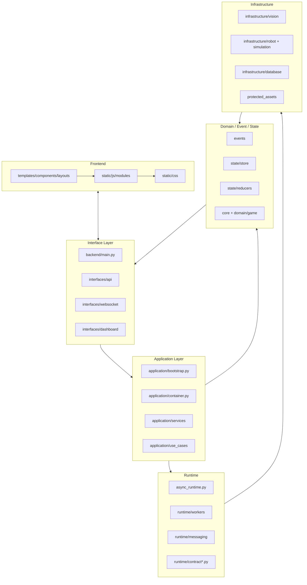
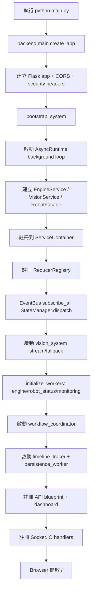
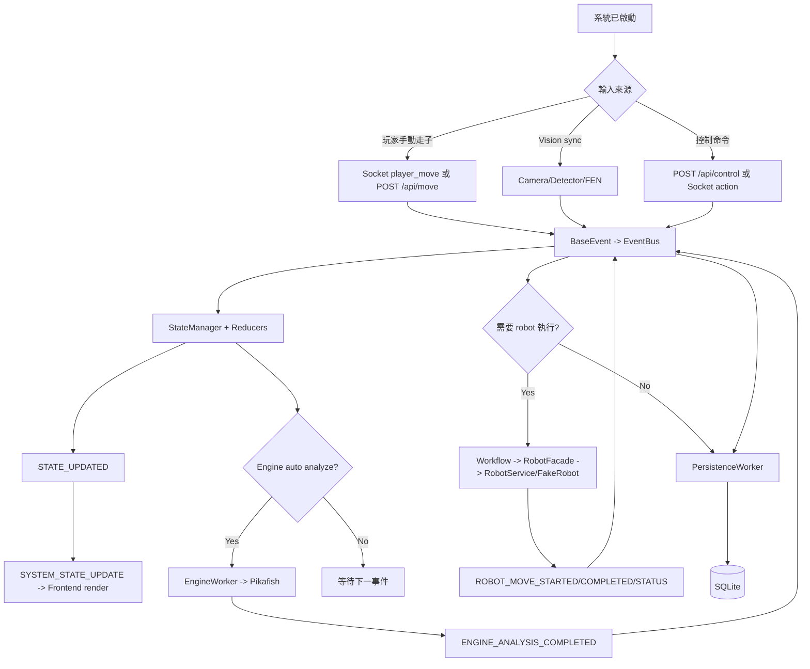
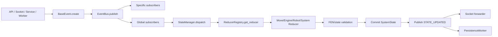

# 第三份：專案架構、運作原理、功能與流程圖

更新日期：2026-05-17

此專案是 S.M.A.R.T. Chess Robot：以 Flask + Socket.IO 提供本機 Web UI，後端用事件驅動整合象棋狀態、Pikafish engine、vision pipeline、robot/fake robot、diagnostics、replay 與 Excel export。

## 1. 架構總覽



## 2. 分層職責

| 層級 | 主要路徑 | 角色 |
| --- | --- | --- |
| 啟動層 | `main.py`、`backend/main.py` | 啟動 Flask/Socket.IO、註冊 route、載入 template/static、安全標頭。 |
| Interface | `backend/interfaces/api`、`backend/interfaces/websocket`、`frontend` | 接收 HTTP/Socket/UI 輸入，輸出 JSON、Socket contract、HTML/CSS/JS。 |
| Application | `backend/application/bootstrap.py`、`services`、`use_cases` | 系統組裝、服務協調、工作流程、runtime/session/safe mode 控制。 |
| Event/State | `backend/events`、`backend/state` | 用 `BaseEvent` 交換資料，透過 reducer 產生唯一可信狀態 SSOT。 |
| Runtime | `backend/runtime` | 背景 asyncio loop、workers、queue、合約 schema、watchdog。 |
| Infrastructure | `backend/infrastructure` | SQLite、vision、robot、simulation、Pikafish/NNUE/YOLO 資產。 |
| Frontend State | `frontend/static/js/modules/state` | 前端自己的 SSOT，正規化後端 payload 並通知 renderer。 |
| Tests/Scripts | `tests`、`frontend/tests`、`scripts` | 驗證 API/Socket/contract/assets/quality/release/smoke。 |

## 3. 啟動流程圖



核心原理：啟動時只做一次 authoritative wiring；所有重要依賴放入 `container`，事件由 `EventBus` 分發，狀態只由 `StateManager` 透過 reducer 改變。

## 4. 運作原理

1. 前端不直接改後端資料，只透過 REST 或 Socket 發送「意圖」。
2. 後端將意圖包成 `BaseEvent`，事件包含 `event_id`、`trace_id`、`source`、`payload`。
3. `EventBus` 將事件送給訂閱者，例如 `StateManager`、workers、services、PersistenceWorker、Socket forwarder。
4. `StateManager` 根據 `ReducerRegistry` 找 reducer，產生新的 `SystemState`，通過 FEN 驗證後 commit。
5. 狀態 commit 後發布 `STATE_UPDATED`，Socket forwarder 轉成穩定的 `SYSTEM_STATE_UPDATE` envelope。
6. 前端 `event_adapter.js` 驗證事件名稱，`normalizer.js` 正規化資料，`state_manager.js` 更新前端 snapshot。
7. renderers 透過 subscriptions 更新 DOM，包括棋盤、engine、robot、vision、diagnostics、dashboard。
8. 所有事件同時被 `PersistenceWorker` 保存到 SQLite，支援 replay、export、audit。

## 5. 主要功能

| 功能 | 使用者看到的能力 | 後端核心檔案 | 前端核心檔案 |
| --- | --- | --- | --- |
| Web UI | landing/player/console 三種 view | `backend/main.py` | `frontend/index.html`、`templates/components/*` |
| 即時同步 | 棋盤、engine、robot、vision、diagnostics 即時更新 | `socket_handler.py`、`contract.py`、`serializers.py` | `event_adapter.js`、`state_manager.js`、`render.js` |
| 手動走子 | 玩家/控制台提交 move | `control_routes.py`、`MoveReducer` | `core/app.js`、board renderer |
| Engine 分析 | 顯示最佳步、分數、深度、多 PV | `engine_worker.py`、`engine_service.py` | `engine_renderer.js` |
| Vision | MJPEG 影像、偵測結果、FEN sync | `vision_routes.py`、`vision_system.py`、`vision_service.py` | `vision_renderer.js` |
| Robot/FakeRobot | 執行走子、顯示連線/忙碌/錯誤 | `robot_facade.py`、`robot_service.py`、`robot_status_worker.py` | `robot_renderer.js` |
| E-Stop | 緊急停止、UI lock、手動恢復 | `estop.py`、`estop_routes.py` | `core/app.js` overlay |
| Diagnostics | health/ready/runtime metrics/assets 狀態 | `diagnostics_routes.py`、`monitoring_worker.py` | `diagnostics_renderer.js`、dashboard |
| Replay | 讀取歷史 step/snapshot | `replay_routes.py`、`replay_manager.py` | API client/console UI |
| Export | Excel/CSV 研究資料匯出 | `export_routes.py`、`excel_exporter.py` | `export_controller.js` |
| Quality/Release | 測試、合約、資產、release zip | `scripts/quality_gate.py`、`build_release_zip.py` | `frontend/tests/*` |

## 6. 系統主流程



## 7. 前端流程

```mermaid
flowchart LR
    HTML[Jinja templates] --> Entry[/static/js/app.js]
    Entry --> Core[modules/core/app.js]
    Core --> API[api_client.js]
    Core --> Socket[socket_client.js]
    Socket --> Adapter[event_adapter.js]
    API --> Commit[commit STATE_UPDATE]
    Adapter --> Commit
    Commit --> Normalizer[normalizer.js]
    Normalizer --> FEState[state_manager.js]
    FEState --> Subs[subscriptions.js]
    Subs --> Render[board/engine/robot/vision/dashboard renderers]
    Render --> DOM[Browser DOM]
```

## 8. 後端事件與狀態流程



## 9. 安全與可靠性設計

| 機制 | 用意 |
| --- | --- |
| JWT admin token | 控制台與控制端點需要 admin 權限。 |
| Rate limit | 限制 login/control/socket 請求頻率。 |
| Payload size limit | 避免過大 HTTP/Socket payload。 |
| Contract validation | 避免後端傳出前端無法處理的 event payload。 |
| E-Stop | 發生緊急情況時清隊列、停 robot、鎖 UI、改 state。 |
| FakeRobot/FakeVision | 沒有實體硬體時仍可 demo/test。 |
| Protected assets manifest | 確保 engine、NNUE、vision model 不被誤刪或換檔。 |
| Persistence queue | 事件寫 DB 不阻塞即時控制流程。 |
| Quality gate | 一次檢查 compile、contract、assets、tests、release hygiene。 |

## 10. 可交付理解版摘要

這份專案的中心思想是「事件驅動 + 單一可信狀態」。前端只負責呈現與發送操作意圖；後端用 `EventBus` 串接 API、Socket、vision、engine、robot、database；狀態只能由 `StateManager` 經 reducer 改變。所有重要輸出再透過 `SYSTEM_STATE_UPDATE` 回到前端，讓 UI 永遠讀同一種合約格式。

整體運作可以濃縮成：

```text
使用者/Camera/Engine/Robot 產生輸入
-> API/Socket/Worker/Service 建立 BaseEvent
-> EventBus 分發
-> StateManager + Reducer 更新 SystemState
-> Socket 合約推送給前端
-> Frontend state 正規化並渲染
-> PersistenceWorker 保存事件到 SQLite
```
