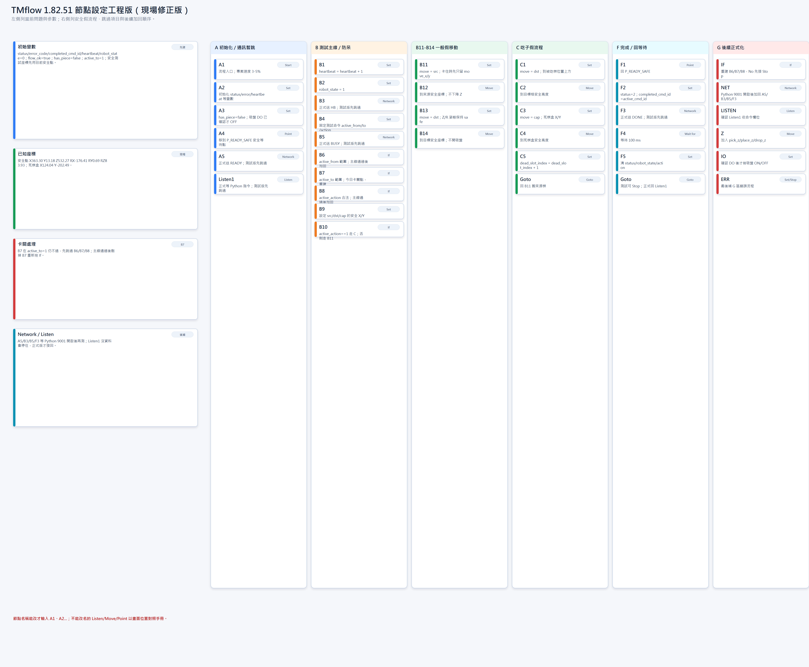
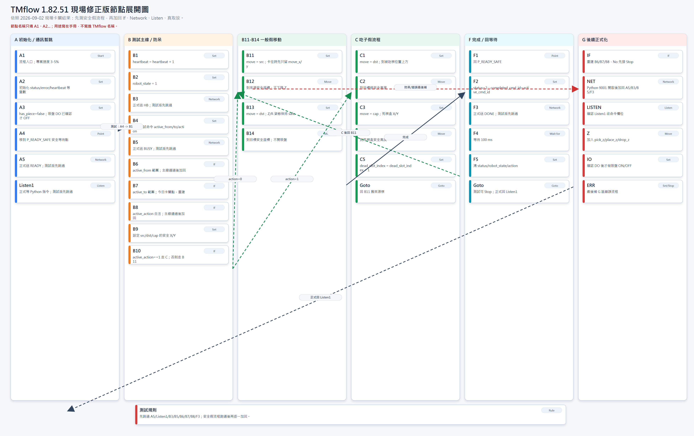

# TMflow 1.82.51 節點計畫書：2026-09-02 現場修正版

最後修正：2026-09-02

> 現場操作請先看 `TMFLOW_1_82_51_FIELD_OPERATION_MANUAL.md`。本文件只作工程參考，不是第一線照做手冊。

本版依現場實作結果重編。重點不是重新推翻已做好的節點，而是把目前能安全測試的主線、今天卡關原因、後續正式化順序拆清楚。

## 圖片






逐步操作請看：

[`TMFLOW_1_82_51_FIELD_OPERATION_MANUAL.md`](TMFLOW_1_82_51_FIELD_OPERATION_MANUAL.md)

逐節點表格請看：

[`TMFLOW_1_82_51_NODE_SETUP_GUIDE.md`](TMFLOW_1_82_51_NODE_SETUP_GUIDE.md)

## 現場已確認規則

右側工具不能當流程節點：

```text
ModbusDev
Operation Space
Set IO while Project Error
Set IO while Project Stop
Stop Watch
Serial Port
路徑生成
關節負載
```

主流程只使用左側可拖曳節點：

```text
Set, Vision, Point, Stop, Wait for, Gateway, If, Pause, Voice, Goto,
Pallet, Display, Move, Circle, SubFlow, Network, Warp, Path, Command,
F-Point, Log, Compliance, New Base, Touch Stop, Smart Insert, Listen,
Force Control, M-Decision, Collision Check, CVNewObj, CVPoint, CVCircle
```

實際會用到：

```text
Start, Set, Point, Wait for, If, Goto, Move, Network, Listen, Stop
```

節點名稱能改時只填純代號，例如 `A2`、`B11`。若 TMflow 自動顯示 `A2SET`，或 Listen/Move/Point 暫時不能改名，以畫面位置對照本計畫即可。

變數名稱建立時不要輸入 `var_`，TMflow 會自動顯示 `var_`。

## 今日卡關結論

目前不是一個問題，而是三類問題同時出現：

| 類別 | 現象 | 判斷 | 目前處理 |
| --- | --- | --- | --- |
| Network | A5、B3、B5 會出現停止專案，但 F3 可通過 | Network 節點可用，但前幾顆設定或 Python 接收端狀態不同 | 安全流程測試時先跳過 A5/B3/B5/F3 |
| If | `active_to=1` 時 B7 仍不通過 | 不是條件數學錯，可能是 B7 節點、出口接線或 If 節點狀態異常 | 先用 `B4 -> B9` 跳過 B6/B7/B8 |
| 測試順序 | 一開始同時測通訊、If、防呆、Move | 問題來源混在一起，難判斷 | 改成一次只測一種風險 |

目前最重要決策：

```text
先跑安全高度假流程
再重建 If 防呆
再接回 Network / Listen
最後才做下降 Z 與吸盤
```

## 已知現場座標

安全等待姿態：

```text
safe_x  = 363.30
safe_y  = 13.18
safe_z  = 532.27
safe_rx = -176.41
safe_ry = 0.69
safe_rz = 83.93
```

死棋盒位置：

```text
cap_x = 124.04
cap_y = -202.49
```

死棋盒的 Z/Rx/Ry/Rz 已量到，但目前測試版先不用，避免過早下降：

```text
drop_z  = 384.54
drop_rx = 179.97
drop_ry = 1.56
drop_rz = -6.10
```

安全假流程先讓來源與目標都使用安全位置：

```text
src_x = 363.30
src_y = 13.18
dst_x = 363.30
dst_y = 13.18
```

## 先建變數

狀態與命令：

```text
status                 int     0
error_code             int     0
completed_cmd_id       int     0
heartbeat              int     0
robot_state            int     0
last_cmd_id            int     0
active_from            int     0
active_to              int     1
active_action          int     0
active_cmd_id          int     1
dead_slot_index        int     0
```

旗標：

```text
flow_ok                bool    true
has_piece              bool    false
```

座標：

```text
src_x                  double  363.30
src_y                  double  13.18
dst_x                  double  363.30
dst_y                  double  13.18
cap_x                  double  124.04
cap_y                  double  -202.49
safe_z                 double  532.27
safe_rx                double  -176.41
safe_ry                double  0.69
safe_rz                double  83.93
move_x                 double  363.30
move_y                 double  13.18
move_z                 double  532.27
move_rx                double  -176.41
move_ry                double  0.69
move_rz                double  83.93
```

## 目前測試版接線

安全假流程先這樣接：

```text
Start -> A2 -> A3 -> A4 -> B1 -> B2 -> B4 -> B9 -> B10
```

先跳過：

```text
A5 Network
Listen1
B3 Network
B5 Network
B6 If
B7 If
B8 If
F3 Network
```

一般搬移測試：

```text
B4 active_action = 0
B10 No/Fail -> B11 -> B12 -> B13 -> B14 -> F1 -> F2 -> F4 -> F5 -> Goto Listen1 或 Stop
```

吃子測試：

```text
B4 active_action = 1
B10 Yes/Pass -> C1 -> C2 -> C3 -> C4 -> C5 -> Goto B11
B11 -> B12 -> B13 -> B14 -> F1 -> F2 -> F4 -> F5
```

## 目前已做節點

| 節點 | 類型 | 目前用途 | 測試版狀態 |
| --- | --- | --- | --- |
| A1 | Start | 專案入口 | 保留 |
| A2 | Set | 初始化狀態 | 保留 |
| A3 | Set | 關吸盤、清 `has_piece` | 保留 |
| A4 | Point | 到 `P_READY_SAFE` | 保留 |
| A5 | Network | 送 `READY` | 先跳過 |
| Listen1 | Listen | 正式等待 Python 指令 | 先跳過 |
| B1 | Set | `heartbeat=heartbeat+1` | 保留 |
| B2 | Set | `robot_state=1` | 保留 |
| B3 | Network | 送 `HB` | 先跳過 |
| B4 | Set | 固定測試命令 | 保留 |
| B5 | Network | 送 `BUSY` | 先跳過 |
| B6 | If | `active_from` 範圍 | 先跳過 |
| B7 | If | `active_to` 範圍，今日卡關點 | 先跳過，之後重建 |
| B8 | If | `active_action` 合法性 | 先跳過 |
| B9 | Set | 設定 `src/dst/cap` 座標 | 保留 |
| B10 | If | 判斷是否吃子 | 保留 |
| B11 | Set | 準備來源安全座標 | 保留；卡住時先簡化成 X/Y |
| B12 | Move | 到來源安全座標 | 保留 |
| B13 | Set | 準備目標安全座標 | 保留 |
| B14 | Move | 到目標安全座標 | 保留 |
| C1 | Set | 吃子先到目標格 | 保留 |
| C2 | Move | 到目標格安全座標 | 保留 |
| C3 | Set | 準備死棋盒座標 | 保留 |
| C4 | Move | 到死棋盒安全座標 | 保留 |
| C5 | Set | `dead_slot_index+1` | 保留 |
| F1 | Point | 回安全等待點 | 保留 |
| F2 | Set | 完成狀態 | 保留 |
| F3 | Network | 送 `DONE` | 測試版先跳過 |
| F4 | Wait for | 等 100 ms | 保留 |
| F5 | Set | 清狀態 | 保留 |

## B7 卡關處理

B7 的值檢查本來應通過：

```text
active_to = 1
var_active_to >= 0
var_active_to <= 89
```

目前處理不是繼續硬修，而是：

1. 先用 `B4 -> B9` 跳過 B6/B7/B8，確認 Move 假流程能跑。
2. 安全假流程通過後，刪掉舊 B7，重新拖一顆新的 `If`。
3. 新 B7 先只測：
   ```text
   var_active_to == 1
   ```
   規則選 `單一`。
4. 成功後再改正式版：
   ```text
   var_active_to >= 0
   var_active_to <= 89
   ```
   規則選 `全部`。

同樣原則：

```text
B6 範圍判斷 -> 全部
B7 範圍判斷 -> 全部
B8 多選一判斷 -> 單一
```

如果 B8 也卡，測試版先改成：

```text
var_active_action >= 0
var_active_action <= 1
```

規則選 `全部`。

## Network 加回策略

安全假流程通過前，不要讓 Network 進主測試線。

加回時所有 Network 先照 F3 的可通過設定複製，只改發送內容：

```text
A5 = READY
B3 = HB
B5 = BUSY
F3 = DONE
```

共同設定：

```text
選擇裝置：ntd_PY9001
模式：發送
綠色圓點：發送內容
發送狀態：var_flow_ok
額外閒置時間：0
```

先不要送：

```text
BUSY,<active_cmd_id>
DONE,<active_cmd_id>
```

先用純文字確認 Network 能過。

## 後續正式化順序

1. 安全假流程通過 `active_action=0`。
2. 安全假流程通過 `active_action=1`。
3. 重建並測 B6、B7、B8。
4. 開 Python 9001，逐顆加回 A5、B3、B5、F3。
5. 確認 Listen1 的接收欄位與 Python 送法。
6. 量測真正棋盤來源格、目標格座標。
7. 確認吸盤 DO 腳位。
8. 加入下降 Z、吸盤 ON/OFF、死棋盒 drop_z。
9. 最後再做 G 錯誤流程。

## 驗收標準

安全假流程完成：

```text
active_action=0 可跑到 F5
active_action=1 可跑 C1-C5，再回 B11，最後跑到 F5
全程不下降 Z
全程不開吸盤
不出現停止專案
```

通訊完成：

```text
Python 9001 已開啟
A5 READY 可通過
B3 HB 可通過
B5 BUSY 可通過
F3 DONE 可通過
```

正式取放完成：

```text
來源格上方安全點正確
目標格上方安全點正確
下降高度正確
吸盤 ON/OFF 正確
死棋可落入盒子
完成後回 P_READY_SAFE
```
