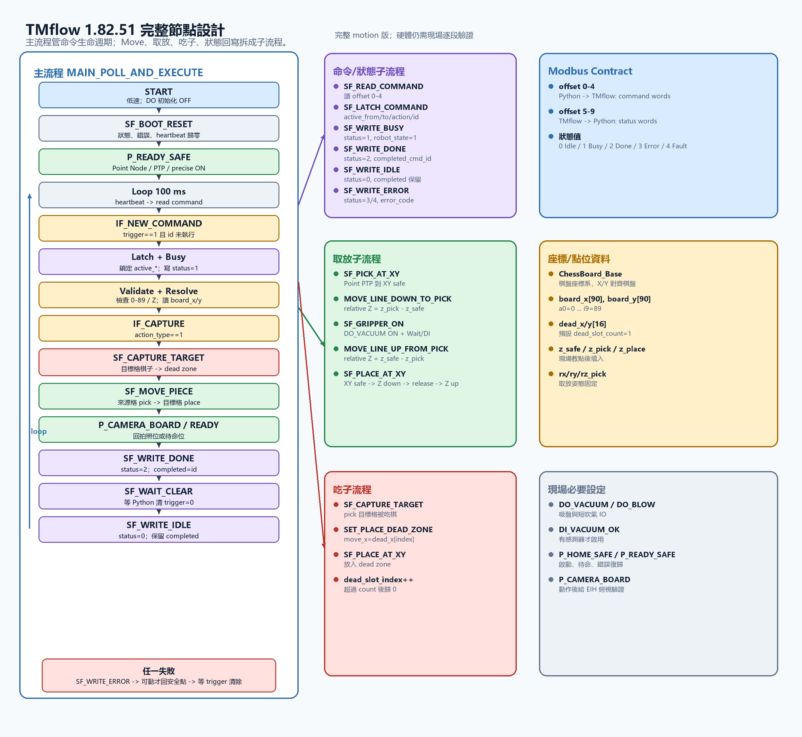
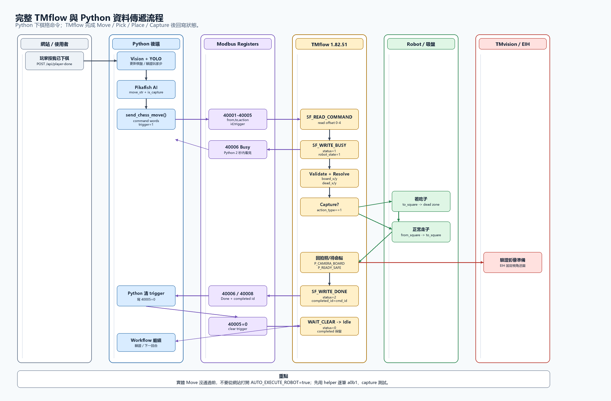

# TMflow 1.82.51 Full Node Design

最後整理日期：2026-08-29

本文件是 `docs/TM_VISION_ROBOT_RUNBOOK.md` 的下一階段：Set-only 握手通過後，才建立這份完整動作版。這不是已完成的硬體驗證紀錄，而是現場要照表建立、分段測試的 TMflow 1.82.51 最終節點設計。

## 0. 結論

最終版採用這個分工：

```text
Python
  -> 負責網站、玩家流程、TMvision HTTP frame ingest、YOLO/SAHI、FEN、棋規、Pikafish、走法選擇
  -> 只把 from_square / to_square / action_type / cmd_id / trigger 寫進 Modbus

TMflow 1.82.51
  -> 負責 Modbus 輪詢、命令鎖定、棋格座標解析、Point/PTP、Move Z、吸盤、吃子區、狀態回寫
  -> 不做棋規、不做 AI、不做 YOLO
```

完整動作版允許使用子流程。主流程只保留命令生命週期；所有會重複的動作拆成子流程，避免主線變成幾百個節點後現場難查。

## 圖片





## 1. 版本與依據

本設計使用目前專題已選定的通訊契約：

```text
PC Python = Modbus TCP server
TMflow    = Modbus TCP client / master
Modbus    = 192.168.10.50:1502
HTTP      = 192.168.10.50:5000
9001 TCP  = optional telemetry only
```

已確認的外部依據：

- Techman 官方 Modbus 範例更新於 2026-03-05，標示適用 TMflow 1.76 以上；其中 `40001` 對應 TMflow side address `0`，`40002` 對應 address `1`。
- Techman 官方 Eye-in-Hand 說明更新於 2026-05-08，標示 TMflow software all versions；TMvision 的角色是 coordinate adjustment 與 vision job administration。
- Techman 官方 Developer Area 說明 Flow Project 是視覺化區塊流程，並列出 Modbus、Ethernet、Listen Server 等整合能力。
- 公開索引的 TMflow software manual 文字顯示 1.82/1.88 的 motion nodes 支援變數輸入，Move node 是相對座標或相對關節位移。實機 1.82.51 畫面欄位名稱仍以現場為準。

## 2. 為什麼完整動作版要放回安全分支

前一份 Set-only 設計刻意不做 Move、不做吸盤、不做安全檢查，是為了只測通訊：

```text
Python command -> TMflow Busy -> TMflow Done -> Python clear trigger
```

完整動作版一旦加入下降、取棋、放棋、吃子，安全分支就不是額外功能，而是必要節點。至少要有：

- 啟動時復位吸盤與狀態。
- 每筆命令只能執行一次。
- 檢查 from/to 是否在 0..89。
- 檢查 Z profile：`z_safe > z_pick`，`z_pick <= z_place < z_safe`。
- Move 失敗、吸盤失敗、trigger 未清除都要寫回 Error。
- 動作完成後回到安全高度或拍照姿態再寫 Done。

## 3. TMflow Project

Project name 建議：

```text
SMART_CHESS_FULL_MOTION
```

Base / TCP：

| 名稱 | 類型 | 用途 |
| --- | --- | --- |
| `ChessBoard_Base` | Custom Base 或 Vision Base | 棋盤座標系。X/Y 盡量與棋盤列線對齊，所有棋格 XY 都用這個 base。 |
| `ChessGripper_TCP` | TCP | 吸盤或夾爪的 tool center point。 |
| `P_HOME_SAFE` | Point | 啟動與異常後的安全位置。 |
| `P_READY_SAFE` | Point | 等待命令的位置。 |
| `P_CAMERA_BOARD` | Point | 若 EIH 需要固定俯視棋盤，動作後回到此點再讓 Python/TMvision 做驗證。 |

Motion 原則：

| 動作 | 使用節點 | 原因 |
| --- | --- | --- |
| 回 HOME / READY / CAMERA | Point Node, PTP | 絕對點位，不累積相對誤差。 |
| 移動到某棋格上方安全高度 | Point Node, PTP 或 Line | 目標是棋格 XY + `z_safe`，用絕對座標。 |
| 垂直下降到取放高度 | Move Node, Line, relative Z | 固定 XY，只做 Z 方向相對移動。 |
| 垂直上升回安全高度 | Move Node, Line, relative Z | 固定 XY，避免拖到棋子。 |
| 吸盤開關 | Set Node / IO Write | 取棋 ON，放棋 OFF。 |
| 狀態回寫 | Modbus Write Node | 寫 Busy / Done / Error / Heartbeat。 |

長距離 XY 不建議用 Move relative，因為多次相對位移會累積誤差。Move node 在本設計只用於相對 Z 下降/上升。

## 4. Modbus Device

建立 Modbus Device：

```text
Name: PC_MODBUS_1502
Protocol: Modbus TCP
Role: Client / Master
Server IP: 192.168.10.50
Server port: 1502
Unit ID: 1
Data type: int16 / word
Register type: Holding Register
Poll interval: 100 ms
Timeout: 1000 ms
Retry: 1 or 2
```

Register map 不變：

| Python register | TMflow protocol offset | TMflow 方向 | 變數短名 | 說明 |
| ---: | ---: | --- | --- | --- |
| 40001 | 0 | Read | `from_square` | 來源格，0..89 |
| 40002 | 1 | Read | `to_square` | 目標格，0..89 |
| 40003 | 2 | Read | `action_type` | `0=move`, `1=capture`, `3=special` |
| 40004 | 3 | Read | `cmd_id` | 命令編號 |
| 40005 | 4 | Read | `trigger` | `1=新命令`, `0=Python 已清除` |
| 40006 | 5 | Write | `status` | `0=Idle`, `1=Busy`, `2=Done`, `3=Error`, `4=Fault` |
| 40007 | 6 | Write | `error_code` | 錯誤碼 |
| 40008 | 7 | Write | `completed_cmd_id` | 完成的命令編號 |
| 40009 | 8 | Write | `heartbeat` | 每輪遞增 |
| 40010 | 9 | Write | `robot_state` | `0=Idle`, `1=Busy`, `2=HoldingPiece`, `3=AtCamera` |

注意：如果 TMflow 畫面問的是 protocol address，填 `0..9`；如果問的是 holding register number，才填 `40001..40010`。本專題 Python 目前使用 `ROBOT_MODBUS_REGISTER_ADDRESSING=holding_40001`。

## 5. 棋格編號

Python 與 TMflow 必須完全一致：

```text
a0=0, b0=1, ... i0=8
a1=9, b1=10, ... i1=17
...
a9=81, b9=82, ... i9=89
```

換算：

```text
file_index = square % 9
rank_index = square / 9 取整數
square     = rank_index * 9 + file_index
```

TMflow 若沒有整數除法節點，不需要在流程內反算 file/rank；直接用 `board_x[square]`、`board_y[square]` 陣列即可。

## 6. 變數與參數

下表用短名表示；如果 TMflow 畫面自動加上 `var_` 前綴，就把 `from_square` 視為 `var_from_square`。

### 6.1 Modbus 與命令變數

| 變數 | 型別 | 初始值 | 用途 |
| --- | --- | ---: | --- |
| `from_square` | int | 0 | Modbus 讀入來源格 |
| `to_square` | int | 0 | Modbus 讀入目標格 |
| `action_type` | int | 0 | Modbus 讀入動作類型 |
| `cmd_id` | int | 0 | Modbus 讀入命令編號 |
| `trigger` | int | 0 | Modbus 讀入觸發值 |
| `status` | int | 0 | 寫回 Python 的命令狀態 |
| `error_code` | int | 0 | 寫回 Python 的錯誤碼 |
| `completed_cmd_id` | int | 0 | 寫回 Python 的完成命令 |
| `heartbeat` | int | 0 | 心跳 |
| `robot_state` | int | 0 | TMflow 狀態摘要 |
| `last_cmd_id` | int | 0 | 防止同一命令重複執行 |

### 6.2 命令鎖定變數

| 變數 | 型別 | 初始值 | 用途 |
| --- | --- | ---: | --- |
| `active_from` | int | 0 | 本次命令鎖定來源格 |
| `active_to` | int | 0 | 本次命令鎖定目標格 |
| `active_action` | int | 0 | 本次命令鎖定 action |
| `active_cmd_id` | int | 0 | 本次命令鎖定 id |
| `flow_ok` | bool | true | 子流程成功/失敗旗標 |
| `has_piece` | bool | false | 吸盤是否已取到棋子 |
| `special_flag` | int | 0 | action 3 保留，目前照 normal move 執行 |

### 6.3 棋盤與吃子座標

| 變數 | 型別 | 初始值 | 用途 |
| --- | --- | ---: | --- |
| `board_x[90]` | double array | 現場填值 | 每個棋格中心 X，index 0..89 |
| `board_y[90]` | double array | 現場填值 | 每個棋格中心 Y，index 0..89 |
| `dead_x[16]` | double array | 現場填值 | 吃子放置區 X；若只用單一收集區，只填 index 0 |
| `dead_y[16]` | double array | 現場填值 | 吃子放置區 Y；若只用單一收集區，只填 index 0 |
| `dead_slot_count` | int | 1 | 已實作幾個吃子位置；單一收集區用 1 |
| `dead_slot_index` | int | 0 | 下一個吃子位置 index |

建議先只用 `dead_slot_count=1`。Python 目前只關心 capture 是否完成，不需要知道吃掉的棋子放到第幾格。

### 6.4 Motion 參數

| 變數 | 型別 | 初始值建議 | 用途 |
| --- | --- | ---: | --- |
| `z_safe` | double | 現場教點後決定 | 高於所有棋子、棋盤邊框與治具的安全高度 |
| `z_pick` | double | 現場教點後決定 | 吸盤接觸棋子上表面的取棋高度 |
| `z_place` | double | `z_pick + 2` 起測 | 放棋高度，可略高於取棋高度 |
| `rx_pick` | double | 現場 TCP 姿態 | 取放姿態 RX |
| `ry_pick` | double | 現場 TCP 姿態 | 取放姿態 RY |
| `rz_pick` | double | 現場 TCP 姿態 | 取放姿態 RZ |
| `speed_travel` | double | 20 | 安全高度水平移動速度，先低速 |
| `speed_approach` | double | 8 | 垂直下降速度 |
| `speed_lift` | double | 12 | 垂直上升速度 |
| `speed_ready` | double | 20 | HOME/READY/CAMERA 速度 |
| `gripper_wait_ms` | int | 300 | 吸盤 ON 後等待 |
| `release_wait_ms` | int | 300 | 吸盤 OFF 後等待 |
| `trigger_clear_timeout_ms` | int | 10000 | 等 Python 清 trigger 的上限 |

### 6.5 Runtime motion 變數

| 變數 | 型別 | 初始值 | 用途 |
| --- | --- | ---: | --- |
| `src_x` / `src_y` | double | 0 | 來源格座標 |
| `dst_x` / `dst_y` | double | 0 | 目標格座標 |
| `cap_x` / `cap_y` | double | 0 | 被吃棋子或 dead zone 座標 |
| `move_x` / `move_y` / `move_z` | double | 0 | Point Node 使用的目標座標 |
| `move_rx` / `move_ry` / `move_rz` | double | 0 | Point Node 使用的姿態 |
| `delta_z` | double | 0 | Move Node 相對 Z 距離 |
| `clear_wait_elapsed_ms` | int | 0 | 等待 trigger 清除時計時 |

### 6.6 IO 參數

| 變數/IO | 型別 | 初始值 | 用途 |
| --- | --- | ---: | --- |
| `DO_VACUUM` | DO channel | 現場指定 | 吸盤真空 ON/OFF |
| `DO_BLOW` | DO channel | optional | 放棋瞬間短吹氣；沒有就不用 |
| `DI_VACUUM_OK` | DI channel | optional | 真空確認；沒有感測器就改用 Wait |
| `use_vacuum_sensor` | bool | false | 是否啟用 `DI_VACUUM_OK` 判斷 |

如果現場沒有真空回饋，`SF_GRIPPER_ON` 只能等待 `gripper_wait_ms`，不能判定真的吸到了棋子。這時測試結果只能寫「動作流程完成」，不能寫「取棋可靠」。

## 7. 主流程節點

主流程名稱：

```text
MAIN_POLL_AND_EXECUTE
```

| 順序 | 節點名稱 | 類型 | 內部設定 | 成功下一步 | 失敗下一步 |
| ---: | --- | --- | --- | --- | --- |
| 1 | `START` | Start | Project speed 先用低速；初期不要開 blending；啟動時 DO 初始化可全部 OFF。 | 2 | - |
| 2 | `CALL_BOOT_RESET` | Subflow | 呼叫 `SF_BOOT_RESET`。 | 3 | `CALL_WRITE_ERROR` |
| 3 | `POINT_READY_AT_START` | Point Node, PTP | Point=`P_READY_SAFE`, TCP=`ChessGripper_TCP`, precise positioning=ON, speed=`speed_ready`。 | 4 | `CALL_WRITE_ERROR` |
| 4 | `WAIT_LOOP` | Wait | `100 ms`。 | 5 | - |
| 5 | `CALL_HEARTBEAT` | Subflow | 呼叫 `SF_HEARTBEAT`。 | 6 | 6 |
| 6 | `CALL_READ_COMMAND` | Subflow | 呼叫 `SF_READ_COMMAND`。 | 7 | `CALL_WRITE_ERROR` |
| 7 | `IF_NEW_COMMAND` | IF | 條件：`trigger==1 AND cmd_id!=last_cmd_id`。 | true -> 8 | false -> 4 |
| 8 | `CALL_LATCH_COMMAND` | Subflow | 呼叫 `SF_LATCH_COMMAND`。 | 9 | `CALL_WRITE_ERROR` |
| 9 | `CALL_WRITE_BUSY` | Subflow | 呼叫 `SF_WRITE_BUSY`。Python 需要先看到 Busy。 | 10 | `CALL_WRITE_ERROR` |
| 10 | `CALL_VALIDATE_COMMAND` | Subflow | 呼叫 `SF_VALIDATE_COMMAND`。 | 11 | `CALL_WRITE_ERROR` |
| 11 | `CALL_RESOLVE_POINTS` | Subflow | 呼叫 `SF_RESOLVE_POINTS`。 | 12 | `CALL_WRITE_ERROR` |
| 12 | `IF_CAPTURE` | IF | 條件：`active_action==1`。 | true -> 13 | false -> 14 |
| 13 | `CALL_CAPTURE_TARGET` | Subflow | 呼叫 `SF_CAPTURE_TARGET`，先把 `to_square` 的棋子移到 dead zone。 | 14 | `CALL_WRITE_ERROR` |
| 14 | `CALL_MOVE_PIECE` | Subflow | 呼叫 `SF_MOVE_PIECE`，把 `from_square` 的棋子放到 `to_square`。 | 15 | `CALL_WRITE_ERROR` |
| 15 | `POINT_CAMERA_OR_READY` | Point Node, PTP | 若 EIH 驗證需要固定視角，Point=`P_CAMERA_BOARD`；否則 Point=`P_READY_SAFE`。 | 16 | `CALL_WRITE_ERROR` |
| 16 | `CALL_WRITE_DONE` | Subflow | 呼叫 `SF_WRITE_DONE`。 | 17 | `CALL_WRITE_ERROR` |
| 17 | `CALL_WAIT_TRIGGER_CLEAR` | Subflow | 呼叫 `SF_WAIT_TRIGGER_CLEAR`。 | 18 | `CALL_WRITE_ERROR` |
| 18 | `CALL_WRITE_IDLE` | Subflow | 呼叫 `SF_WRITE_IDLE`，保留 `completed_cmd_id=active_cmd_id`。 | 4 | `CALL_WRITE_ERROR` |
| E1 | `CALL_WRITE_ERROR` | Subflow | 呼叫 `SF_WRITE_ERROR`。 | E2 | - |
| E2 | `POINT_SAFE_AFTER_ERROR` | Point Node, PTP | 若仍可動，回 `P_READY_SAFE`；若 controller fault，不強制動。 | E3 | E3 |
| E3 | `CALL_WAIT_TRIGGER_CLEAR_AFTER_ERROR` | Subflow | 等 Python 清 trigger。 | 18 | 4 |

主流程方向：

```text
START
  -> SF_BOOT_RESET
  -> P_READY_SAFE
  -> loop:
       heartbeat
       read command
       if no new command: loop
       latch command
       write Busy
       validate command
       resolve source / target / dead zone
       if capture: capture target to dead zone
       move source to target
       move to camera or ready point
       write Done
       wait Python clears trigger
       write Idle
       loop
```

## 8. 子流程設計

### 8.1 `SF_BOOT_RESET`

用途：啟動時把 TMflow 與 Python 看到的狀態歸零。

| 順序 | 節點名稱 | 類型 | 內部設定 |
| ---: | --- | --- | --- |
| 1 | `SET_INIT_VARS` | Set | `status=0`, `error_code=0`, `completed_cmd_id=0`, `heartbeat=0`, `robot_state=0`, `last_cmd_id=0`, `flow_ok=true`, `has_piece=false`, `dead_slot_index=0` |
| 2 | `SET_GRIPPER_OFF_INIT` | Set / IO | `DO_VACUUM=OFF`; 若有 `DO_BLOW`，也設 OFF。 |
| 3 | `MB_WRITE_INIT_STATUS` | Modbus Write | offset 5=`status`, 6=`error_code`, 7=`completed_cmd_id`, 8=`heartbeat`, 9=`robot_state`。 |

### 8.2 `SF_HEARTBEAT`

| 順序 | 節點名稱 | 類型 | 內部設定 |
| ---: | --- | --- | --- |
| 1 | `SET_HEARTBEAT_INC` | Set | `heartbeat=heartbeat+1`。若 `heartbeat>32760`，下一個 IF 轉回 1。 |
| 2 | `IF_HEARTBEAT_WRAP` | IF | true: `heartbeat>32760`。 |
| 3 | `SET_HEARTBEAT_WRAP` | Set | `heartbeat=1`。 |
| 4 | `MB_WRITE_HEARTBEAT` | Modbus Write | offset 8=`heartbeat`, offset 9=`robot_state`。 |

### 8.3 `SF_READ_COMMAND`

| 順序 | 節點名稱 | 類型 | 內部設定 |
| ---: | --- | --- | --- |
| 1 | `MB_READ_COMMAND_WORDS` | Modbus Read | Device=`PC_MODBUS_1502`; Read Holding Registers; start offset 0; quantity 5; variable order=`from_square,to_square,action_type,cmd_id,trigger`。 |

### 8.4 `SF_LATCH_COMMAND`

用途：避免 TMflow 執行中 Python register 被下一筆覆蓋造成動作混亂。

| 順序 | 節點名稱 | 類型 | 內部設定 |
| ---: | --- | --- | --- |
| 1 | `SET_ACTIVE_COMMAND` | Set | `active_from=from_square`, `active_to=to_square`, `active_action=action_type`, `active_cmd_id=cmd_id`, `last_cmd_id=cmd_id`, `flow_ok=true`, `error_code=0`, `special_flag=0` |
| 2 | `IF_SPECIAL_ACTION` | IF | 條件：`active_action==3`。true 時進下一個 Set。 |
| 3 | `SET_SPECIAL_AS_NORMAL` | Set | `special_flag=1`；目前象棋沒有升變處理，所以 action 3 先照 normal move。 |

### 8.5 `SF_WRITE_BUSY`

| 順序 | 節點名稱 | 類型 | 內部設定 |
| ---: | --- | --- | --- |
| 1 | `SET_BUSY_VALUES` | Set | `status=1`, `error_code=0`, `robot_state=1`。 |
| 2 | `MB_WRITE_BUSY_STATUS` | Modbus Write | offset 5=`status`。 |
| 3 | `MB_WRITE_BUSY_ERROR` | Modbus Write | offset 6=`error_code`。 |
| 4 | `MB_WRITE_BUSY_ROBOT_STATE` | Modbus Write | offset 9=`robot_state`。 |

若畫面支援連續寫入，可把 2/3 合併成 offset 5 quantity 2。

### 8.6 `SF_VALIDATE_COMMAND`

| 順序 | 節點名稱 | 類型 | 條件或設定 | 失敗時 |
| ---: | --- | --- | --- | --- |
| 1 | `IF_FROM_RANGE` | IF | `active_from>=0 AND active_from<=89` | `error_code=101`, `flow_ok=false` |
| 2 | `IF_TO_RANGE` | IF | `active_to>=0 AND active_to<=89` | `error_code=102`, `flow_ok=false` |
| 3 | `IF_NOT_SAME` | IF | `active_from!=active_to` | `error_code=104`, `flow_ok=false` |
| 4 | `IF_ACTION_SUPPORTED` | IF | `active_action==0 OR active_action==1 OR active_action==3` | `error_code=103`, `flow_ok=false` |
| 5 | `IF_Z_PROFILE` | IF | `z_safe>z_pick AND z_pick<=z_place AND z_place<z_safe` | `error_code=111`, `flow_ok=false` |
| 6 | `IF_FLOW_OK` | IF | `flow_ok==true` | false -> 回主流程 error |

### 8.7 `SF_RESOLVE_POINTS`

用途：把棋格 index 轉成 TMflow motion 用的 X/Y。

| 順序 | 節點名稱 | 類型 | 內部設定 |
| ---: | --- | --- | --- |
| 1 | `SET_SOURCE_XY` | Set | `src_x=board_x[active_from]`, `src_y=board_y[active_from]`。 |
| 2 | `SET_TARGET_XY` | Set | `dst_x=board_x[active_to]`, `dst_y=board_y[active_to]`。 |
| 3 | `SET_DEAD_XY` | Set | `cap_x=dead_x[dead_slot_index]`, `cap_y=dead_y[dead_slot_index]`。 |
| 4 | `IF_DEAD_SLOT_VALID` | IF | `dead_slot_index>=0 AND dead_slot_index<dead_slot_count`。失敗：`error_code=112`, `flow_ok=false`。 |

如果 TMflow 1.82.51 的陣列寫法在現場不方便，保守替代方案是建立 `SF_RESOLVE_POINTS_SWITCH`，用 Switch/Gateway 或 IF chain：

```text
active_from == 0  -> src_x=board_x_00, src_y=board_y_00
active_from == 1  -> src_x=board_x_01, src_y=board_y_01
...
active_from == 89 -> src_x=board_x_89, src_y=board_y_89
```

`active_to` 同樣一組。這會增加節點數，但不改 Python 合約。

### 8.8 `SF_MOVE_PIECE`

用途：正常走子。

| 順序 | 節點名稱 | 類型 | 內部設定 |
| ---: | --- | --- | --- |
| 1 | `SET_PICK_SOURCE` | Set | `move_x=src_x`, `move_y=src_y`。 |
| 2 | `CALL_PICK_AT_XY` | Subflow | 呼叫 `SF_PICK_AT_XY`。 |
| 3 | `IF_PICK_OK` | IF | `flow_ok==true AND has_piece==true`；失敗走 error。 |
| 4 | `SET_PLACE_TARGET` | Set | `move_x=dst_x`, `move_y=dst_y`。 |
| 5 | `CALL_PLACE_AT_XY` | Subflow | 呼叫 `SF_PLACE_AT_XY`。 |
| 6 | `IF_PLACE_OK` | IF | `flow_ok==true AND has_piece==false`；失敗走 error。 |

### 8.9 `SF_CAPTURE_TARGET`

用途：先清掉 `to_square` 上被吃的棋。

| 順序 | 節點名稱 | 類型 | 內部設定 |
| ---: | --- | --- | --- |
| 1 | `SET_PICK_CAPTURED_PIECE` | Set | `move_x=dst_x`, `move_y=dst_y`。 |
| 2 | `CALL_PICK_AT_XY` | Subflow | 呼叫 `SF_PICK_AT_XY`。 |
| 3 | `IF_CAPTURE_PICK_OK` | IF | `flow_ok==true AND has_piece==true`。 |
| 4 | `SET_PLACE_DEAD_ZONE` | Set | `move_x=cap_x`, `move_y=cap_y`。 |
| 5 | `CALL_PLACE_AT_XY` | Subflow | 呼叫 `SF_PLACE_AT_XY`。 |
| 6 | `IF_CAPTURE_PLACE_OK` | IF | `flow_ok==true AND has_piece==false`。 |
| 7 | `SET_DEAD_SLOT_NEXT` | Set | `dead_slot_index=dead_slot_index+1`。 |
| 8 | `IF_DEAD_SLOT_WRAP` | IF | 條件：`dead_slot_index>=dead_slot_count`。true -> 下一個 Set。 |
| 9 | `SET_DEAD_SLOT_ZERO` | Set | `dead_slot_index=0`。 |

### 8.10 `SF_PICK_AT_XY`

用途：到 `move_x/move_y` 位置取起棋子。

| 順序 | 節點名稱 | 類型 | 內部設定 |
| ---: | --- | --- | --- |
| 1 | `SET_SAFE_POSE` | Set | `move_z=z_safe`, `move_rx=rx_pick`, `move_ry=ry_pick`, `move_rz=rz_pick`, `robot_state=1`。 |
| 2 | `POINT_PTP_TO_SAFE_XY` | Point Node, PTP | Target Type=Cartesian Coordinate；Base=`ChessBoard_Base`; TCP=`ChessGripper_TCP`; X=`move_x`; Y=`move_y`; Z=`move_z`; RX/RY/RZ=`move_rx/move_ry/move_rz`; speed=`speed_travel`; precise positioning=ON; blending=OFF。 |
| 3 | `SET_PICK_DELTA_Z` | Set | `delta_z=z_pick-z_safe`。這個值應是負數。 |
| 4 | `MOVE_LINE_DOWN_TO_PICK` | Move Node, Line | Relative to `ChessBoard_Base`; X=0; Y=0; Z=`delta_z`; RX/RY/RZ=0; speed=`speed_approach`; precise positioning=ON; blending=OFF。 |
| 5 | `CALL_GRIPPER_ON` | Subflow | 呼叫 `SF_GRIPPER_ON`。 |
| 6 | `IF_GRIPPER_ON_OK` | IF | `flow_ok==true`。 |
| 7 | `SET_LIFT_DELTA_Z` | Set | `delta_z=z_safe-z_pick`。 |
| 8 | `MOVE_LINE_UP_FROM_PICK` | Move Node, Line | Relative to `ChessBoard_Base`; X=0; Y=0; Z=`delta_z`; speed=`speed_lift`; precise positioning=ON。 |
| 9 | `SET_HAS_PIECE` | Set | `has_piece=true`, `robot_state=2`。 |

### 8.11 `SF_PLACE_AT_XY`

用途：到 `move_x/move_y` 位置放下棋子。

| 順序 | 節點名稱 | 類型 | 內部設定 |
| ---: | --- | --- | --- |
| 1 | `SET_SAFE_POSE` | Set | `move_z=z_safe`, `move_rx=rx_pick`, `move_ry=ry_pick`, `move_rz=rz_pick`, `robot_state=1`。 |
| 2 | `POINT_PTP_TO_SAFE_XY` | Point Node, PTP | 同 `SF_PICK_AT_XY`，只改目標 XY 來自目前 `move_x/move_y`。 |
| 3 | `SET_PLACE_DELTA_Z` | Set | `delta_z=z_place-z_safe`。這個值應是負數。 |
| 4 | `MOVE_LINE_DOWN_TO_PLACE` | Move Node, Line | Relative to `ChessBoard_Base`; X=0; Y=0; Z=`delta_z`; speed=`speed_approach`; precise positioning=ON。 |
| 5 | `CALL_GRIPPER_OFF` | Subflow | 呼叫 `SF_GRIPPER_OFF`。 |
| 6 | `IF_GRIPPER_OFF_OK` | IF | `flow_ok==true`。 |
| 7 | `SET_LIFT_DELTA_Z` | Set | `delta_z=z_safe-z_place`。 |
| 8 | `MOVE_LINE_UP_FROM_PLACE` | Move Node, Line | Relative to `ChessBoard_Base`; X=0; Y=0; Z=`delta_z`; speed=`speed_lift`; precise positioning=ON。 |
| 9 | `SET_NO_PIECE` | Set | `has_piece=false`, `robot_state=1`。 |

### 8.12 `SF_GRIPPER_ON`

| 順序 | 節點名稱 | 類型 | 內部設定 |
| ---: | --- | --- | --- |
| 1 | `SET_VACUUM_ON` | Set / IO | `DO_VACUUM=ON`。 |
| 2 | `WAIT_VACUUM_SETTLE` | Wait | `gripper_wait_ms`。 |
| 3 | `IF_USE_VACUUM_SENSOR` | IF | 條件：`use_vacuum_sensor==true`。false 直接成功。 |
| 4 | `IF_VACUUM_OK` | IF | 條件：`DI_VACUUM_OK==ON`。false：`error_code=201`, `flow_ok=false`。 |

### 8.13 `SF_GRIPPER_OFF`

| 順序 | 節點名稱 | 類型 | 內部設定 |
| ---: | --- | --- | --- |
| 1 | `SET_VACUUM_OFF` | Set / IO | `DO_VACUUM=OFF`。 |
| 2 | `IF_USE_BLOW` | IF | 若有 `DO_BLOW` 才進短吹氣。 |
| 3 | `SET_BLOW_ON` | Set / IO | `DO_BLOW=ON`。 |
| 4 | `WAIT_BLOW` | Wait | `100 ms`。 |
| 5 | `SET_BLOW_OFF` | Set / IO | `DO_BLOW=OFF`。 |
| 6 | `WAIT_RELEASE_SETTLE` | Wait | `release_wait_ms`。 |

### 8.14 `SF_WRITE_DONE`

| 順序 | 節點名稱 | 類型 | 內部設定 |
| ---: | --- | --- | --- |
| 1 | `SET_DONE_VALUES` | Set | `status=2`, `error_code=0`, `completed_cmd_id=active_cmd_id`, `robot_state=0` 或在 `P_CAMERA_BOARD` 時設 `3`。 |
| 2 | `MB_WRITE_DONE_STATUS` | Modbus Write | offset 5=`status`。 |
| 3 | `MB_WRITE_DONE_ERROR` | Modbus Write | offset 6=`error_code`。 |
| 4 | `MB_WRITE_DONE_COMPLETED` | Modbus Write | offset 7=`completed_cmd_id`。 |
| 5 | `MB_WRITE_DONE_HEARTBEAT` | Modbus Write | offset 8=`heartbeat`。 |
| 6 | `MB_WRITE_DONE_ROBOT_STATE` | Modbus Write | offset 9=`robot_state`。 |

### 8.15 `SF_WRITE_IDLE`

| 順序 | 節點名稱 | 類型 | 內部設定 |
| ---: | --- | --- | --- |
| 1 | `SET_IDLE_VALUES` | Set | `status=0`, `robot_state=0`, `error_code=0`；不要清 `completed_cmd_id`。 |
| 2 | `MB_WRITE_IDLE_STATUS` | Modbus Write | offset 5=`status`。 |
| 3 | `MB_WRITE_IDLE_ROBOT_STATE` | Modbus Write | offset 9=`robot_state`。 |

### 8.16 `SF_WRITE_ERROR`

| 順序 | 節點名稱 | 類型 | 內部設定 |
| ---: | --- | --- | --- |
| 1 | `SET_ERROR_DEFAULT` | Set | 若 `error_code==0`，設 `error_code=501`；`status=3`, `robot_state=0`, `has_piece=false`。 |
| 2 | `SET_VACUUM_OFF_ON_ERROR` | Set / IO | `DO_VACUUM=OFF`, `DO_BLOW=OFF`。 |
| 3 | `MB_WRITE_ERROR_STATUS` | Modbus Write | offset 5=`status`。 |
| 4 | `MB_WRITE_ERROR_CODE` | Modbus Write | offset 6=`error_code`。 |
| 5 | `MB_WRITE_ERROR_ROBOT_STATE` | Modbus Write | offset 9=`robot_state`。 |

如果是 controller alarm、保護停止或急停，`status` 改寫 `4`，`error_code=401`。

### 8.17 `SF_WAIT_TRIGGER_CLEAR`

| 順序 | 節點名稱 | 類型 | 內部設定 |
| ---: | --- | --- | --- |
| 1 | `SET_CLEAR_WAIT_ZERO` | Set | `clear_wait_elapsed_ms=0`。 |
| 2 | `WAIT_CLEAR_STEP` | Wait | `100 ms`。 |
| 3 | `MB_READ_TRIGGER_ONLY` | Modbus Read | offset 4 quantity 1 -> `trigger`。 |
| 4 | `IF_TRIGGER_CLEAR` | IF | `trigger==0` true -> 子流程結束。 |
| 5 | `SET_CLEAR_WAIT_INC` | Set | `clear_wait_elapsed_ms=clear_wait_elapsed_ms+100`。 |
| 6 | `IF_CLEAR_TIMEOUT` | IF | `clear_wait_elapsed_ms>=trigger_clear_timeout_ms`。true：`error_code=302`, `flow_ok=false`；false 回 2。 |

### 8.18 `SF_SEND_TELEMETRY_OPTIONAL`

這個子流程不放在主線成功條件。只有需要 `9001` 觀測時才接。

| 節點 | 類型 | 內部設定 |
| --- | --- | --- |
| `NETWORK_SEND_STATUS_JSON` | Network Node | TCP client to `192.168.10.50:9001`；送 JSON line，包含 key、status、cmd_id、robot_state。 |
| `NETWORK_SEND_POSE_JSON` | Network Node | 需要 pose 時才送。 |

若 `TMFLOW_INGEST_KEY` 有值，不能送純 `HB,1` CSV；要送 JSON 並帶 key。若只是實驗室測 9001 連線，可以暫時不設 telemetry key，再用 CSV。

## 9. Error Code

| Code | 意義 | 建議處理 |
| ---: | --- | --- |
| 0 | no error | 正常 |
| 101 | `from_square` 不在 0..89 | 檢查 Python register 或棋格 mapping |
| 102 | `to_square` 不在 0..89 | 檢查 Python register 或棋格 mapping |
| 103 | `action_type` 不支援 | 檢查 Python action value |
| 104 | from 與 to 相同 | 拒絕 no-op |
| 111 | Z profile 不安全 | 檢查 `z_safe/z_pick/z_place` |
| 112 | dead slot index 不合法 | 檢查 `dead_slot_count/dead_slot_index` |
| 201 | 吸盤 ON 後沒有真空確認 | 檢查吸盤、氣源、DI |
| 202 | 放棋後仍偵測到吸附 | 若有 release sensor 才使用 |
| 301 | motion node failed | 檢查點位、速度、姿態、奇異點、工作範圍 |
| 302 | Python 沒有清 trigger | 檢查 Python 是否看到 Done/Error |
| 401 | robot alarm / protective stop / E-stop | 先處理控制器警報，不要自動重試 |
| 501 | unknown error | 保守錯誤 |

## 10. Point / Coordinate Table 建立方式

推薦做法是建立 `ChessBoard_Base`，再用 `board_x[90]`、`board_y[90]` 保存每格中心座標。

若棋盤固定且 base 已對齊棋盤：

```text
index = rank * 9 + file
board_x[index] = x_a0 + file * cell_x
board_y[index] = y_a0 + rank * cell_y
```

如果棋盤與 base 有輕微旋轉或不完全正交，請不要只用單一 `cell_x/cell_y` 猜。先用 `ChessBoard_Base` 校正，或在外部表格算出 90 格 X/Y 後再填入 TMflow array。

保守替代做法：

```text
P_SQ_00_SAFE / P_SQ_00_PICK / P_SQ_00_PLACE
...
P_SQ_89_SAFE / P_SQ_89_PICK / P_SQ_89_PLACE
P_DEAD_00_SAFE / P_DEAD_00_PICK / P_DEAD_00_PLACE
```

這個方式點位很多，但不依賴陣列與座標變數。若 1.82.51 現場 UI 不支援 Point Node 使用變數座標，就改用這個保守版。

## 11. Python 端不需要改的部分

這份 TMflow 最終版沿用目前程式碼，不需要改 Python contract：

```text
ROBOT_ADAPTER=modbus
ROBOT_MODBUS_ROLE=server
ROBOT_MODBUS_SERVER_HOST=192.168.10.50
ROBOT_MODBUS_SERVER_PORT=1502
ROBOT_MODBUS_PAYLOAD_MODE=square_command
ROBOT_SQUARE_REQUIRE_COMPLETED_COMMAND=true
```

Python 送出命令後會期待：

```text
1. TMflow 在約 2 秒內寫 status=1 Busy
2. TMflow 完成後寫 status=2 Done
3. completed_cmd_id 等於 Python 寫入的 cmd_id
4. Python 清 trigger=0
5. TMflow 回 status=0 Idle
```

如果完整動作時間會超過目前 timeout，才需要調整：

```env
ROBOT_MOTION_TIMEOUT_SEC=30
```

不要一開始就開很大。先量測實際 pick/place/capture 時間，再加 20% 餘裕。

## 12. 分段測試順序

不要直接從網站按「我已下棋」就讓真機自動跑。順序如下：

| 階段 | 目標 | 成功條件 |
| ---: | --- | --- |
| 0 | Set-only handshake | `status=1 -> status=2 -> trigger=0 -> status=0` |
| 1 | HOME/READY 單點 | `P_READY_SAFE` 可以低速到位 |
| 2 | 單一棋格上方安全點 | `POINT_PTP_TO_SAFE_XY` 到 `a0` 上方，不下降 |
| 3 | Z 下降/上升空跑 | `MOVE_LINE_DOWN_TO_PICK` 與 `MOVE_LINE_UP_FROM_PICK` 不碰撞 |
| 4 | 吸盤單獨測試 | ON/OFF 正常，若有 DI 則回饋正常 |
| 5 | 單格 pick/place | 從 `a0` 拿到 `b0`，不用 AI |
| 6 | capture | 先把 `to_square` 移到 dead zone，再走來源棋 |
| 7 | Python helper 驅動 | `scripts/start_modbus_square_server.py --test-move a0b1` 可完成 |
| 8 | 網站流程 | 保持 `AUTO_EXECUTE_ROBOT=false` 先確認 AI move 產生正確 |
| 9 | 自動真機 | 所有前面通過後才考慮 `AUTO_EXECUTE_ROBOT=true` |

## 13. 最終完成條件

只有以下全部成立，才能說完整真機流程完成：

```text
TMvision HTTP image ingest verified
TMvision detection parser verified
YOLO result usable for current board
Modbus square-command handshake verified
TMflow point table verified
HOME / READY / CAMERA points verified
Z safe / pick / place profile verified
gripper ON/OFF verified
normal move verified
capture move verified
Python sees Busy / Done / completed_cmd_id
Python clears trigger and TMflow returns Idle
no known critical collision or timeout risk
```

在此之前，正確描述是：

```text
Full TMflow node design complete; hardware verification pending.
```
