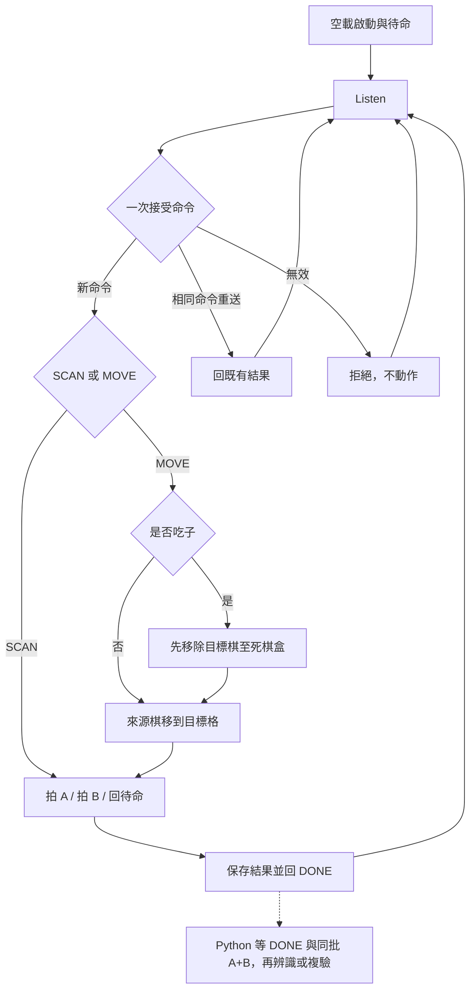

# TMflow 完整設計 v3.0：DO3 吸盤、雙張拍攝、Python 計算落點

> 歷史設計（2026-10-05 標示）：本文雙張流程已被單張基準取代，僅供追溯，不可作現行控制器施工指引。來源模型 `tmflow_v3_nodes.json` 已是 v3.1；其設計仍須與 README 所述 Python 全動作主控流程核對，尚未實機驗證。

更新：2026-09-18。目標控制器：TMflow 1.82.51。

**交付狀態：完整設計與設定規格，尚不是已部署的新控制程式。** 本次更新設計、點位表、節點表、圖與現況說明；未修改控制器專案，未啟動手臂。現有 Python 尚需接入雙張配對及 Listen 動態點位命令，詳見第 11 節。

## 1. 已確認事項與設計前提

- 使用者已確認 IP、指令通訊及 Listen 可以使用，無須回到先前的連線排錯。
- 吸盤開關是 **DO3**。本文以 `SUCTION_LEVEL` 代表吸附、`RELEASE_LEVEL` 代表釋放；暫按 ON/OFF 設計，控制箱/工具端位置與實際極性尚待確認，不直接修改實機 I/O。
- 棋盤太大，改為 A/B 兩張。本文暫按同一顆手臂相機移到兩個固定拍照姿態；若為兩顆固定相機，影像配對規則不變，但 S 區取消相機移位節點。
- 不增加「每個節點先查有沒有設定完成」的支線。示教與校正在開機前一次完成；循環內只有一個命令接受入口 B1，另保留必要分流與失敗出口。
- 沒有確認現場有負壓感測器，不把 DI 回授設為必備節點，也不再把 DO3 開啟寫成「已確定吸住」。吸附等待時間由單顆實測決定。

## 2. 責任分工與三種操作

| 位置 | 負責的工作 |
| --- | --- |
| Python | 兩張照片配對、各視角辨識與校正、合併 90 個棋盤交點、棋規與 AI、棋格到機械座標換算、命令與回報關聯。 |
| TMflow | 接收點位、執行已設計的移動、控制 DO3、移到兩個拍照點、呼叫兩個 Vision 工作、回報本筆結果。 |
| 人員初次設定 | 示教固定點、工具/TCP、棋盤基準與高度；提供兩視角的校正資料。 |

命令只分兩種 `kind`，移子再分 `action`：

| 操作 | kind | action | TMflow 路徑 |
| --- | ---: | ---: | --- |
| 初始盤面、玩家走後拍照、重新拍攝 | 1 / SCAN_PAIR | 0 | B → S → F → Listen |
| 一般 AI 移子 | 2 / MOVE | 0 | B → M → S → F → Listen |
| AI 吃子 | 2 / MOVE | 1 | B → C → M → S → F → Listen |

移子命令內含「移完後拍兩張」。Python 收到這筆 DONE 後，使用同筆已收齊的照片複驗，**不要再額外送一次 SCAN_PAIR**。複驗不通過時再由操作員或明確重拍流程建立新拍攝批次，不自動重做移子。

[易讀流程圖與 v2 差異標記](tmflow_1_82_51_full_node_design.png)將 55 個節點按功能分組，保留編號；右側比較改雙張拍攝前的本機 v2 文件，不是控制器專案快照。與先前 v3 節點圖相比，本次僅調整排版，沒有改動節點或流程。


```mermaid
flowchart TD
  A[空載啟動與待命] --> L[Listen]
  L --> B{一次接受命令}
  B -->|新命令| K{SCAN 或 MOVE}
  B -->|相同命令重送| R[回既有結果]
  B -->|無效| E[拒絕，不動作]
  R --> L
  E --> L
  K -->|SCAN| S[拍 A / 拍 B / 回待命]
  K -->|MOVE| C{是否吃子}
  C -->|是| D[先移除目標棋至死棋盒]
  C -->|否| M[來源棋移到目標格]
  D --> M
  M --> S
  S --> F[保存結果並回 DONE]
  F --> L
  F -.-> P[Python 等 DONE 與同批 A+B，再辨識或複驗]
```

完整每個節點、出口與 I/O 時機見 [逐節點設定表](TMFLOW_1_82_51_NODE_SETUP_GUIDE.md)。

若現場已做好舊版，依 [舊版改新版對照表](TMFLOW_V2_TO_V3_MIGRATION.md) 重用既有節點、補新接線；新舊編號不能直接視為同一用途。

## 3. 需要建立的點位

「Point」是節點類型；「PTP / Line」是它的運動模式。本文所有位置都是絕對目標，使用 Point 節點引用點位管理器中的點。不要只建立 `move_x` 變數就以為控制器會自行使用它。

### 3.1 固定點：初次現場示教，共 7 個

| 點名 | 用途與設定 | 移動方式 |
| --- | --- | --- |
| P_READY_SAFE | 空載待命、相機移位過渡點；與棋盤/周邊物保持已驗證間隙，記錄完整 XYZ/RxRyRz。 | 起始/空載過渡採已校驗 PTP 路徑；精準到位。 |
| P_PHOTO_A_APPROACH | A 拍照點的接近/退出點；與 P_PHOTO_A 使用同一姿態。 | 待命至接近點採已校驗 PTP；接近至拍照採 Line。 |
| P_PHOTO_A | 第一張，近側棋盤；視野涵蓋完整寬度及近側半盤，固定曝光、焦距、姿態。 | Line，精準到位，再等待 settle_ms。 |
| P_PHOTO_B_APPROACH | B 拍照點的接近/退出點；與 P_PHOTO_B 使用同一姿態。 | 同 A；A/B 之間先經待命過渡點。 |
| P_PHOTO_B | 第二張，遠側棋盤；與 A 保留一至兩排交點重疊。 | Line，精準到位，再等待 settle_ms。 |
| P_DROP_ABOVE | 死棋盒上方轉移點；高度高於盒緣，與取放轉移平面、工具姿態相容。 | 沿已校驗路徑 Line；必要時另示教中繼點。 |
| P_DROP_RELEASE | 盒內投影範圍的釋放位置；與上方點相同 XY/姿態，只有 Z 不同。 | Line 下降，精準到位，DO3 釋放，再 Line 抬升。 |

不得沿用舊文件數值當成已確認安全值。P_READY_SAFE 用於進入取放路徑時，必須與動態 ABOVE 點及 P_DROP_ABOVE 的轉移高度、抓取姿態相容；不把拍照姿態直接帶入持棋路段。PTP 的兩個端點等高不代表中間路徑等高；Line 也必須檢查實際可達性。若現場某段路徑不可直達，就為該段加入必要中繼點，不能只提高速度或刪除錯誤分支。

### 3.2 動態點：建立模板，共 5 個，由 Python 每筆更新

| 點名 | 本輪座標 | 用途 |
| --- | --- | --- |
| P_SRC_ABOVE | 來源 X/Y + safe_z + 固定取放姿態 | 來源棋上方。 |
| P_SRC_PICK | 來源 X/Y + pick_z + 同姿態 | 吸取來源棋。 |
| P_DST_ABOVE | 目標 X/Y + safe_z + 同姿態 | 目標格上方。 |
| P_DST_PICK | 目標 X/Y + pick_z + 同姿態 | 吃子時吸取目標棋。 |
| P_DST_PLACE | 目標 X/Y + place_z + 同姿態 | 放來源棋。 |

這 5 個點最初要在點位管理器中以已知可達的樣板建立，設定相同 Base、吸盤 Tool/TCP 與合適的機械臂構型。更新 `.Value` 不等於自動修正 Base/TCP/構型；取放範圍須驗證可沿用樣板構型。

取放點、拍照點、路徑拐點及回待命點採精準到位、不混合。固定相機姿態與抓棋姿態可不同，但每段垂直進退的起終姿態保持一致。

## 4. 初始棋盤資料與座標計算

**需要棋盤在機械座標系內的位置與方向，只有棋盤長寬不夠。** 一般不必示教 90 個交點：先量角落交點與驗證點，再由 Python 計算。

建議提供下列資料，單位 mm/degree；每筆必須附相同的 Base 名稱與吸盤 TCP 名稱：

1. `a0`、`i0`、`a9` 三個不共線的棋盤交點 X/Y/Z。
2. `i9` 及中心附近如 `e4` 的量測值，先保留作獨立驗證點。
3. 最左至最右交點間距、最下至最上交點間距；不是棋盤木板外框大小。
4. `safe_z`、`pick_z`、`place_z`、固定 `Rx/Ry/Rz`、七個固定點與棋子頂面高度。
5. A/B 各一組影像校正點及對應棋格；至少四個不共線交點，最好涵蓋視野周邊與重疊區。

定義 `f=0..8` 對應 a..i，`r=0..9` 對應棋譜 0..9；`a0` 是紅方視角左下交點。畫面上下翻轉由視覺校正處理，不改棋譜座標名稱。

等間距、平面棋盤的幾何關係：

```text
u = (P_i0 - P_a0) / 8
v = (P_a9 - P_a0) / 9
P(f,r) = P_a0 + f*u + r*v
```

9 條直線有 8 個間距，10 條橫線有 9 個間距，不能除以 9 和 10。三維公式可描述棋盤平面；**目前 `Kinematics.calibrate_from_points()` 實作的是 XY 仿射，不會自動補償傾斜棋盤的 Z**。本版先採水平棋盤及固定取放 Z；若實測四角高度不同到會影響取放，需擴充平面 Z 或逐點高度，不能只套固定 pick_z。

例：`b0c2` 的來源是 `P(1,0)`，目標是 `P(2,2)`，再各自組成上方/抓取/放置點。棋盤旋轉由兩個基底向量處理，不假設棋盤一定平行機械 X/Y 軸。

若實體河界間距與其他列不同，不使用上式平均分配全部 9 段；須提供每一列的實測距離，改用列位置表。棋子高度不一致時同樣不能盲目共用一個抓取高度。

完整填寫表見 [現場操作手冊](TMFLOW_1_82_51_FIELD_OPERATION_MANUAL.md)。提供量測資料後，Python 能保存校正並自行計算每一手；不需要每次下棋再人工計算起終座標。

## 5. Python 如何把座標交給 TMflow

新版選用你已確認可用的 **Listen / TMSCT**。既有 Modbus 棋格命令與 `tmflow_json` JSON adapter 不等同這個協定；目前不可只改 adapter 名稱就假設已切換。

一次命令的步驟：

1. Python 確認本輪已完成校正與盤面判斷，MOVE 計算 5 個動態目標點；SCAN_PAIR 不改取放點位。同一個命令佇列只保留唯一活動命令。
2. 確認流程已進入 Listen。Python 先送 `var_cmd_ready=false` 並收到 ACK，再下發命令欄位與點位，最後設 `var_cmd_ready=true`。只有這個發送器可以寫命令，測試工具不得同時接管。
3. 等待相應 TMSCT 的成功回覆；任何欄位或點位設定失敗就不送退出命令。ACK 必須檢查內容，不能只印出封包就當成功。
4. 設定成功後送普通 `ScriptExit()`，讓流程走 Pass 到 B1。不要使用 `ScriptExit(1)` 代替；它屬另一種控制語意。
5. TMflow 的 Point 節點引用已更新的 P_SRC/P_DST 等點位，按既定順序執行。寫入點位本身不是移動命令；後面的 Point 節點才使用它。
6. Python 等待相同命令編號的結果與 A/B 影像。下一筆仍需等流程回 Listen，不能只看 DONE 就立即插入新命令。

點位設定的**語法示意**如下，數值應由量測計算代入；不可照示意資料直接驅動手臂：

```text
Point["P_SRC_ABOVE"].Value = {src_x, src_y, safe_z, tool_rx, tool_ry, tool_rz}
Point["P_SRC_PICK"].Value = {src_x, src_y, pick_z, tool_rx, tool_ry, tool_rz}
Point["P_DST_ABOVE"].Value = {dst_x, dst_y, safe_z, tool_rx, tool_ry, tool_rz}
Point["P_DST_PICK"].Value = {dst_x, dst_y, pick_z, tool_rx, tool_ry, tool_rz}
Point["P_DST_PLACE"].Value = {dst_x, dst_y, place_z, tool_rx, tool_ry, tool_rz}
```

上面是 TMSCT 的腳本內容，不是原始 TCP 完整封包，也不是 JSON。封包長度、checksum、回覆解析可沿用並加強既有 `scripts/tmflow_connection_check.py` 的 TM 封包實作，正式發送器必須處理拆包及 ACK 關聯。1.84 官方手冊確認 Point.Value 與 ScriptExit 語意，1.82.51 的屬性讀寫須先在 Listen 只讀/改點位測試中確認；詳見第 12 節。

## 6. 變數、命令與回報

在 TMflow 變數管理器建立完整名稱，不混用 `active_from` 與 `var_active_from`：

| 變數 | 型別 | 用途 |
| --- | --- | --- |
| var_bound_session_id | string | 本次控制器啟動綁定的會話；A2 清空，首次 Listen 由 PC 建立，重連不清除。 |
| var_session_id | string | 收到的命令會話，必須等於非空的 bound_session_id。 |
| var_cmd_id | int | 本會話遞增命令編號；不在每回合清零。 |
| var_cmd_ready | bool | 本筆欄位與點位已完整下發；不是設定完成檢查。 |
| var_cmd_class | int | B1 計算：0=拒絕，1=新命令，2=已完成命令重送。 |
| var_kind | int | 1=SCAN_PAIR，2=MOVE。 |
| var_action | int | 0=一般，1=吃子；SCAN 固定 0。 |
| var_from / var_to | int | 棋格編號 0..89，移子時不得相同；供驗證與記錄。 |
| var_capture_id | string | 本次 A/B 影像唯一批次，重拍換新值。 |
| var_capture_phase | int | 0=初始，1=玩家走後，2=手臂走後，3=重拍。 |
| var_cmd_hash | string | Python 對完整命令的摘要；相同 ID 不得改內容。 |
| var_last_cmd_id / var_last_cmd_hash | int / string | B2 接受時保存；斷線後不盲目重做。 |
| var_last_capture_id | string | B2 保存的批次；回報及故障歸屬以接受的命令為準。 |
| var_last_result | string | B2 清空，F1 存 DONE；G1 僅對未結束的活動命令存 ERR，不覆蓋已完成結果。 |
| var_status / var_robot_state | int | status: 0 idle/1 busy/2 done/3 error；robot_state: 0 idle/1 ready/2 busy/3 error。 |
| var_error_code | int | 已定義的數字錯誤碼；不塞文字到整數欄位。 |
| var_failed_node / var_fault_context | string | 故障節點與發生情境；啟動、拒絕回報及完成回報失敗不冒充移子失敗。 |

固定設定另存：Base、Tool/TCP、safe/pick/place 高度、grip/release/settle 等待、DO3 吸附與釋放電位。來源/目標 XYZ 姿態直接更新點位模板，不再在 TMflow 建立 90 格座標陣列。

B1 用 Set 計算分類，再用 B1A、B1B 兩個 If 導向 B2/R1/E1，沒有自創的三出口 Gateway。判斷順序如下（語意規格，實際表達式依控制器編輯器建立）：

1. 不完整、會話不同、kind/action 不合法、capture_id 空白，或 MOVE 的 from/to 超出 0..89/相等：分類 0。
2. cmd_id 等於 last_cmd_id、hash 相同且 last_result 非空：分類 2；不同內容重用 ID 則分類 0。
3. cmd_id 大於 last_cmd_id，且沒有前一筆未結束的命令：分類 1。所有較舊 ID 都拒絕，不因快取只留最後一筆就當新命令。

`var_from/var_to` 使用 `rank*9+file`；這是 v3 的約定，不直接混用舊 Modbus 的格子編號。hash 涵蓋 kind/action、格子、所有點位、capture_id 與校正版本，作為重送內容識別，不代替 ACK、範圍限制或點位讀回。

首次 Listen 且 bound_session_id 為空時，PC 產生新會話、寫入並讀回確認，不退出 Listen、不動作。重連沿用該會話與本機保存的命令日誌；PC 遺失日誌時停止自動派令，人工復歸後才開新會話。每次命令只寫 var_session_id，不能順便覆寫 bound_session_id。A2 只在專案新啟動執行，不能接進循環。

Python 在下發前完成有限數值、工作區與校正版本驗證；這不需要在每個 Point 前插入設定檢查。固定等待時間與 Network/Vision timeout 在現場表填入，任一接收超時都結束本次等待，不設無限重試。

建議沿用現有 Network 認證方式，回報 JSON line，例如下面的協定範例（不是可直接貼入 TMflow 的字串拼接表達式）：

```json
{"key":"<existing-key>","event":"busy","session_id":"S1","cmd_id":42,"capture_id":"S1-42-verify","status_code":1,"robot_state_code":2}
{"key":"<existing-key>","event":"done","session_id":"S1","cmd_id":42,"completed_command_id":42,"capture_id":"S1-42-verify","status_code":2,"robot_state_code":1}
{"key":"<existing-key>","event":"error","session_id":"S1","cmd_id":42,"error_code":301,"failed_node":"S4","status_code":3,"robot_state_code":3}
```

若現場已使用帶編號 CSV，可保留既有通道並擴充明確關聯；不能把新 JSON 直接送至只接受 CSV 的既有程序。本文新增的 session/capture 欄位尚需程式接入；目前 ingest 能接收部分狀態欄位，不會自動完成這套工作流。

新版建議錯誤碼：101=命令欄位無效、102=會話不同、103=舊 ID 或內容衝突、201=動作失敗、301=影像擷取/接收失敗、401=通訊失敗。REJECTED 表示未接受命令；ERR 表示已接受命令未正常結束。Python 的影像配對逾時或複驗失敗另記錄，不把已完成的 MOVE 重新派送。

## 7. 兩張照片怎麼變成完整棋盤

### 7.1 取景與校正

- A 預計涵蓋 0..5 列，B 涵蓋 4..9 列；每張都要涵蓋 a..i 全寬，包含邊緣棋子的完整圖像。實際取景範圍以現場畫面為準。
- 每張影像各有校正 H_A、H_B，將該圖的偵測位置轉成共同棋格 `(file,rank)`。不同相機姿態不能共用同一張原圖單應矩陣。
- 建議 A 負責主結果 0..4 列，B 負責 5..9 列；重疊的 4/5 列拿來比較，不重複增加棋子。
- 相機儘量接近垂直觀察；棋子頂面與棋盤平面有高度差，須用實際棋子驗證映射誤差，不能只測空棋盤。

### 7.2 配對，不直接把照片上下貼起來

每張需要 `capture_id`、`view=A/B`、所用校正版本；兩張必須在同一個盤面不再移棋的期間取得。

```text
批次 42 / A → 保存 A → 立即回接收 ACK
批次 42 / B → 保存 B → 立即回接收 ACK
DONE / 命令 42，手臂已回待命
    ↓
分別辨識 A 與 B，映射到相同的 90 個交點
    ↓
合併一次完整盤面 → 初始盤面 / 玩家走法 / 手臂結果複驗
```

影像到達和 DONE 的先後順序都可處理；以「同批 A+B + 相同命令 DONE」作為發布盤面結果的條件。A/B 尚未收齊時不更新棋局、不發動 AI、不視為少棋。

單張缺失、兩張同為 A、不同批次或重疊區矛盾時，Python 提示重拍；重拍建立新批次並拍完整兩張，不混用前一批的另一半。棋子數量比較當前局面，吃子後不再要求固定 32 顆。

### 7.3 影像上傳的實作前提

現有 TMvision HTTP 分類/偵測入口只處理單張。新版需在原有授權入口加上批次與視角識別，或接入受控的相機上傳橋接器。若 TMvision External Classification 能傳遞動態表單/URL/header，就明確傳入 capture_id/view；**目前沒有證據可保證現場版本支援任意動態 header**。

若只能填固定 URL，可用不同 A/B 路徑識別視角，但這只解決 view，沒有解決 capture_id。必須在影像傳輸橋接器將每次實際拍攝請求與活動命令綁定，再轉交 Python；不能單靠抵達時間猜批次或把舊圖貼上新 ID。這是雙張軟體接入的必要項目，不是要在 TMflow 增加許多設定檢查節點。

S4/S10 的 ACK 僅表示影像已接收；不能讓 S4 等全盤辨識完成，否則 B 尚未拍攝就互相等待。每次 Vision 呼叫必須重新取像，不讀前一姿態的快取影像。

優先沿用現有 External Classification 的接收回覆格式：`{"message":"success","result":"frame_received","score":1.0}`，但必須在成功保存至該批次的 A/B 緩衝後才回覆。Vision 工作的通過條件設定為收到 `frame_received`，不是「整盤棋子辨識成功」。這是本專案現有 API 的格式，不保證所有 TMvision 版本不需調整；先用現場工作確認 parser 接受它。不要將新版上傳接到會直接發布單張偵測結果的舊 detect 路徑。

## 8. 每一輪實際操作

1. 開機空載回待命，Listen 等命令。Python 在正式對弈前送 SCAN_PAIR，建立初始盤面。
2. 玩家下完棋並收手，按「我已下棋」。Python 開新批次，送 SCAN_PAIR。
3. TMflow 拍 A、拍 B、回待命並回 DONE。Python 合併盤面、驗證玩家走法、請 AI 算下一手。
4. Python 計算動態點位，送 MOVE；有吃子則先清目標棋，再搬來源棋。
5. TMflow 同筆命令內拍 A、B 複驗，回待命並回 DONE。
6. Python 比對實際盤面與預期盤面，通過才交還玩家。失敗顯示具體差異，不自行重做移子。

## 9. 精簡檢查與失敗處理

已刪除循環內逐格/逐點「是否設定」檢查、重複網路預檢、每筆固定 HB 節點、假 `has_piece=true` 保證，以及用固定 100ms 當上位機已確認的做法。

保留：B1 命令關聯與有效性、兩個用途分流 B4/B5、Vision/Network 的有限等待及失敗出口、Python A/B 配對及盤面複驗。這些直接防止重複移棋、半張盤面與流程互等。

G 區不強制 DO3 OFF，不從未知位置自動回家。Stop/Error 時控制器的 Status IO 也可能改變 DO3，初次設定須核對；單靠 G1 沒寫 OFF 不能保證吸附保持。吸盤在停止後採何種狀態依現場設備決定。

表中 failure 表示失敗處理需求；使用控制器實際可用的出口或結果變數，不假設 Point 一定有 Fail 腳。系統級警報若直接停止專案，Python 應將活動命令標為結果未確認，不宣稱 G 區一定可執行。

F1 已保存 DONE 而 F2 發送失敗時，G1 只記通訊故障，不把 DONE 改成動作 ERR；G2 限時重送既有結果並通知故障，然後停止。R1 的快取重送只適用仍在 Listen 且快取未重置的情況。若已停止，先人工確認再復歸，不能為了取得回報直接重跑整個專案。

完成回報遺失只能重傳保存結果，不能重做 MOVE；重啟後先建立新會話、拍兩張確認盤面，再接受新動作。

## 10. 前次 8 項問題在新版的處置

| 前次問題 | 新版設計 |
| --- | --- |
| 缺命令防重複與 from!=to | 集中 B1；只保留一次接受/拒絕/重送分類。 |
| 直接降低高度移至死棋盒 | P_DROP_ABOVE → Line 下降 → 釋放 → Line 抬升。 |
| DO 開就宣稱抓取成功 | 使用 DO3 操作語意；無感測器不增加假回授，單顆實測確認。 |
| DONE 無編號及複驗事件缺口 | 同 ID 的結果加影像配對；列為 Python 待接入，不再宣稱已完成。 |
| 失敗出口不完整 | 明確標出通訊/影像失敗與停止，保留結果、禁止盲目重做。 |
| robot_state/status 混用 | 第 6 節固定兩張映射。 |
| 點位/Base/TCP/姿態不清楚 | 7 固定點、5 動態點、基準與高度填寫表。 |
| 舊圖與受損字串 | 圖與節點表由同一 JSON 產生；更新狀態與入口文件。 |

## 11. 本機軟體現況與接入工作

| 模組 | 現在的證據 | v3 需要的修改 |
| --- | --- | --- |
| Kinematics | 已有三點以上 XY 仿射校正與棋格換算。 | 重用現有實作；新增量測資料，不建第二套座標來源。 |
| TM Listen 測試工具 | 能組 TM 封包、查 Listen、送變數/ScriptExit。 | 正式 adapter 增加完整點位命令、正確 ACK 與結果關聯；不將假觸發器當正式發送器。 |
| FrameBuffer | `get_latest_raw()` 會丟掉較舊幀。 | A/B 在進入 latest-only 單張流程前配對保存；不能連發兩張就算支援。 |
| vision_frame_io | 接收一張、直接 put_raw。 | 解析 view/capture_id、隔離未完成批次，與拍攝請求關聯。 |
| 視覺校正與 VisionService | 目前主要以單張完整棋盤處理。 | A/B 各自校正與辨識，合併後只發布一次完整盤面。 |
| TMflow Network ingest | 回報 `ROBOT.STATUS_UPDATED`。 | 同筆命令的完成等待與工作流對接，保存 session/capture_id，避免舊 DONE 誤觸發。 |
| WorkflowCoordinator | 完成事件後另開複驗擷取。 | 改用 MOVE 命令附帶的同批 A/B 圖，不重複拍攝。 |

此表是明確的接入規格，不表示以上修改已實作。現有 `.env`、密鑰及控制器連線未被本次文件更新覆蓋。不能設定不存在的 `ROBOT_ADAPTER=listen` 就當完成，也不能把 `ROBOT_GRIPPER_REGISTER=3` 當 DO3；Modbus register 與實體 I/O 是不同項目。

## 12. 技術核對與決策紀錄

Decision：保留已通的 Listen，Python 擁有棋格校正並下發動態 Point；TMflow 擁有取放與拍攝順序。Date：2026-09-18。

Reason：避免重複維護 90 格點表，符合使用者要由電腦計算來源/目標座標及簡化 TMflow 的需求。Alternative：傳棋格編號讓 TMflow 計算；需維護另一套校正，本版不採用。

Technology：TMSCT / Point.Value / ScriptExit。官方來源：[OMRON Expression Editor and Listen Node I848，1.84](https://files.omron.eu/downloads/latest/manual/en/i848_tm_expression_editor_and_listen_node_reference_manual_en.pdf?v=1)，參數化 Point 章節與 ScriptExit 章節。官方資料支持點位值可讀寫與普通 ScriptExit 後續沿 Pass 執行；本機也已有 TM 封包測試工具。

Known limitation：可查文件為 1.84，現場為 1.82.51；新 Point 屬性與影像 metadata 方式需在現場版本核對。DO3 接線極性、相機是否為同一顆 EIH、所有新點位仍屬待確認資料。外部資料只支持上述介面語意，本文節點、配對協定與校正策略為本專案設計，不是原廠提供的象棋流程。
