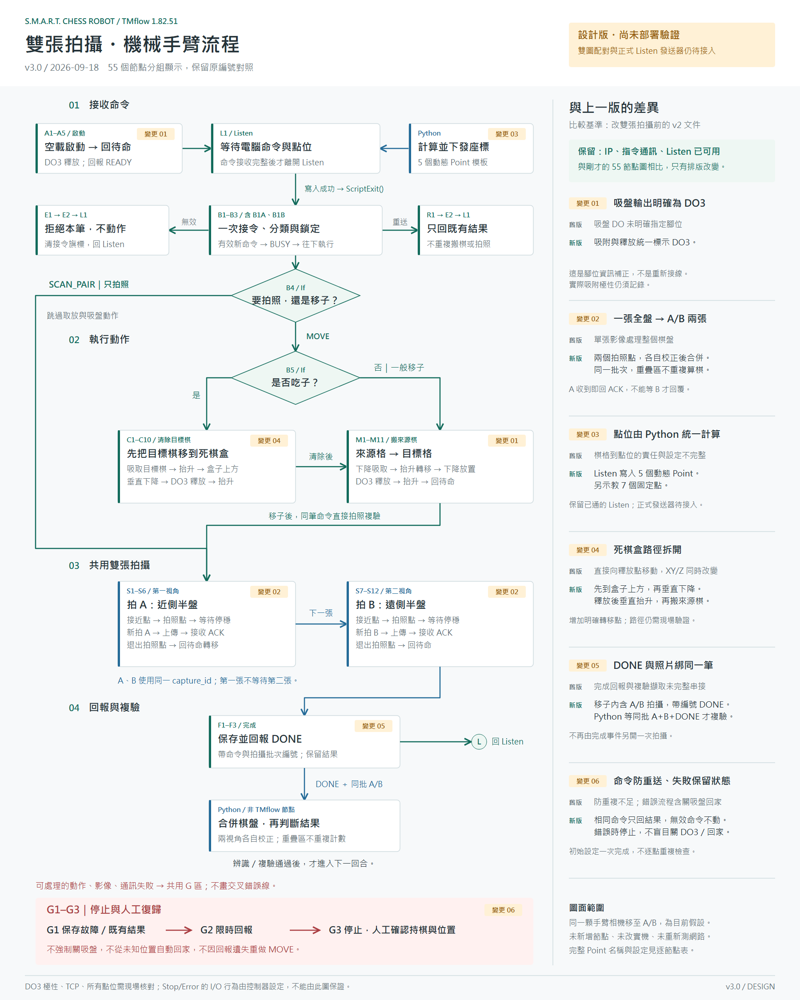

# TMflow 1.82.51：DO3 吸盤與雙視角棋盤流程：完整逐節點設定表

> 過期產物（2026-10-05 標示）：本表及相關 PNG/SVG 仍描述 v3.0，與已改為單張的 v3.1 來源模型不同。重新產生前不可用作現行施工依據。目前環境缺少專案 Node 24 執行檔與 Playwright，產圖同步未完成。

版本 3.0；更新 2026-09-18。狀態：設計完成，Python 與控制器尚待依此整合。

本表由 `tmflow_v3_nodes.json` 產生；修改主規格後執行 `scripts/generate_tmflow_left_palette_diagrams.mjs`，同步節點表與圖。

完整點位、變數、命令格式及棋盤校正見 [完整設計書](TMFLOW_1_82_51_FULL_NODE_DESIGN.md)；資料填寫見 [現場操作手冊](TMFLOW_1_82_51_FIELD_OPERATION_MANUAL.md)。

## 共通設定

- IP、Listen、指令通訊已由使用者確認可用。
- DO3 為吸盤開關；暫按 ON 吸附、OFF 釋放設計，接線位置及極性待確認。
- 暫按同一顆手臂相機移至 A、B 兩個拍照點設計。
- 這是新版建置規格，雙張配對、Listen 點位下發與完成事件整合尚未接入應用程式。
- 固定點與動態點使用 Point 節點的絕對目標；PTP/Line 是運動模式，不是必須另外拖入的 Move 節點。
- 取放、轉移拐點、拍照均採精準到位且不混合；所有路段仍需現場驗證。
- failure 是失敗語意，只接控制器實際提供的 Fail 出口。系統級警報由控制器停止處理，不假設每個 Point 都有 Fail 接腳。
- 沒有負壓感測器就不增加虛假的 DI 確認節點；DO3 與等待只表示吸附操作，單顆實測後才啟用自動取放。
- 不加入逐點『是否已設定』檢查；校正在開機前完成，B1 只檢查本筆命令。
- B1 用 Set 計算分類，再用 B1A/B1B 兩個 If 分支；不需要假設存在三出口 Gateway 節點。
- 節點描述中的 cmd_id 等是縮寫，實際變數一律使用完整設計書的 var_ 名稱。
- status: 0 idle/1 busy/2 done/3 error；robot_state: 0 idle/1 ready/2 busy/3 error。

## 全流程圖

主圖將 55 個節點按功能分組，未增刪節點；右側比較改雙張拍攝前的 v2 文件。與上一張 v3 節點圖相比只有排版改變。[開啟向量圖放大](tmflow_1_82_51_full_node_design.svg)。

## A：啟動與等待

| 節點 | 類型 | 設定與動作 | 出口 |
| --- | --- | --- | --- |
| A1 | Start | 空載、已在已知起始區域時啟動；中斷持棋不走此入口。 | 下一步: A2 |
| A2 | Set | 清空 bound_session_id 與命令快取；last_cmd_id=0、cmd_ready=false；只在新啟動執行。 | 下一步: A3 |
| A3 | Set / IO | DO3=RELEASE_LEVEL；初始化空載狀態。 | 下一步: A4 |
| A4 | Point | P_READY_SAFE；PTP，已校驗起始路徑，精準到位。 | 下一步: A5 / 失敗: G1 |
| A5 | Network | 回報 READY；沿用已通的回報連線與認證。 | 下一步: L1 / 失敗: G1 |
| L1 | Listen | 接收完整命令及動態點位；ScriptExit() 後走 Pass。 | Pass: B1 / 失敗: G1 |

## B：一次接令與分流

| 節點 | 類型 | 設定與動作 | 出口 |
| --- | --- | --- | --- |
| B1 | Set | 一次計算 cmd_class：1=完整有效新命令、2=同 ID/內容的完成重送、0=拒絕。 | 下一步: B1A |
| B1A | If | cmd_class==1？這是 B1 分類出口，不重複做校正檢查。 | 是: B2 / 否: B1B |
| B1B | If | cmd_class==2？是則只重送快取，否則拒絕。 | 是: R1 / 否: E1 |
| B2 | Set | 保存本輪 ID/hash/capture_id；清本輪 last_result；status=1、robot_state=2。 | 下一步: B3 |
| B3 | Network | 回報 BUSY，帶 session_id、cmd_id。 | 下一步: B4 / 失敗: G1 |
| B4 | If | kind=1（SCAN_PAIR）走拍攝；kind=2（MOVE）走移子分支。 | 拍攝: S1 / 移子: B5 |
| B5 | If | action=1 先清除目標棋；action=0 直接搬來源棋。 | 吃子: C1 / 一般: M1 |
| R1 | Network | 相同命令只重送保存結果，不重新搬棋或拍照。 | 下一步: E2 / 失敗: G1 |
| E1 | Network | 回 REJECTED、cmd_id、錯誤碼；沒有動作。 | 下一步: E2 / 失敗: G1 |
| E2 | Set | 清 cmd_ready；保留已接受 ID 與結果快取。 | 下一步: L1 |

## C：吃子：先移除目標棋

| 節點 | 類型 | 設定與動作 | 出口 |
| --- | --- | --- | --- |
| C1 | Point | P_DST_ABOVE；Line，安全高度已校驗路徑。 | 下一步: C2 / 失敗: G1 |
| C2 | Point | P_DST_PICK；Line 垂直下降、精準到位。 | 下一步: C3 / 失敗: G1 |
| C3 | Set / IO | DO3=SUCTION_LEVEL；只代表吸盤已啟動。 | 下一步: C4 |
| C4 | Wait for | 等待 grip_wait_ms；無回授不宣稱已吸住。 | 下一步: C5 |
| C5 | Point | P_DST_ABOVE；Line 垂直抬升。 | 下一步: C6 / 失敗: G1 |
| C6 | Point | P_DROP_ABOVE；Line，維持已校驗高度與姿態。 | 下一步: C7 / 失敗: G1 |
| C7 | Point | P_DROP_RELEASE；Line 垂直下降、精準到位。 | 下一步: C8 / 失敗: G1 |
| C8 | Set / IO | DO3=RELEASE_LEVEL；棋子落入收納盒。 | 下一步: C9 |
| C9 | Wait for | 等待 release_wait_ms。 | 下一步: C10 |
| C10 | Point | P_DROP_ABOVE；Line 垂直抬升。 | 下一步: M1 / 失敗: G1 |

## M：搬來源棋到目標格

| 節點 | 類型 | 設定與動作 | 出口 |
| --- | --- | --- | --- |
| M1 | Point | P_SRC_ABOVE；Line，已校驗安全高度路徑。 | 下一步: M2 / 失敗: G1 |
| M2 | Point | P_SRC_PICK；Line 垂直下降、精準到位。 | 下一步: M3 / 失敗: G1 |
| M3 | Set / IO | DO3=SUCTION_LEVEL。 | 下一步: M4 |
| M4 | Wait for | 等待 grip_wait_ms；單顆測試確認吸附。 | 下一步: M5 |
| M5 | Point | P_SRC_ABOVE；Line 垂直抬升。 | 下一步: M6 / 失敗: G1 |
| M6 | Point | P_DST_ABOVE；Line，保持轉移高度及姿態。 | 下一步: M7 / 失敗: G1 |
| M7 | Point | P_DST_PLACE；Line 垂直下降、精準到位。 | 下一步: M8 / 失敗: G1 |
| M8 | Set / IO | DO3=RELEASE_LEVEL。 | 下一步: M9 |
| M9 | Wait for | 等待 release_wait_ms。 | 下一步: M10 |
| M10 | Point | P_DST_ABOVE；Line 垂直抬升。 | 下一步: M11 / 失敗: G1 |
| M11 | Point | P_READY_SAFE；已校驗空載路徑，精準到位，再拍兩張複驗。 | 下一步: S1 / 失敗: G1 |

## S：共用雙張拍攝

| 節點 | 類型 | 設定與動作 | 出口 |
| --- | --- | --- | --- |
| S1 | Point | P_PHOTO_A_APPROACH；已校驗空載路徑，PTP。 | 下一步: S2 / 失敗: G1 |
| S2 | Point | P_PHOTO_A；Line、精準到位，對準近側棋盤。 | 下一步: S3 / 失敗: G1 |
| S3 | Wait for | 等待現場量測的 settle_ms。 | 下一步: S4 |
| S4 | Vision | JOB_BOARD_A：新拍 A 圖，上傳 capture_id/view=A；接收 ACK 後繼續。 | 下一步: S5 / 失敗: G1 |
| S5 | Point | P_PHOTO_A_APPROACH；Line 退出拍照位置。 | 下一步: S6 / 失敗: G1 |
| S6 | Point | P_READY_SAFE；已校驗空載轉移路徑。 | 下一步: S7 / 失敗: G1 |
| S7 | Point | P_PHOTO_B_APPROACH；已校驗空載路徑，PTP。 | 下一步: S8 / 失敗: G1 |
| S8 | Point | P_PHOTO_B；Line、精準到位，對準遠側棋盤。 | 下一步: S9 / 失敗: G1 |
| S9 | Wait for | 等待 settle_ms。 | 下一步: S10 |
| S10 | Vision | JOB_BOARD_B：新拍 B 圖，上傳相同 capture_id/view=B；接收 ACK 後繼續。 | 下一步: S11 / 失敗: G1 |
| S11 | Point | P_PHOTO_B_APPROACH；Line 退出拍照位置。 | 下一步: S12 / 失敗: G1 |
| S12 | Point | P_READY_SAFE；精準到位後才回 DONE。 | 下一步: F1 / 失敗: G1 |

## F：完成與下一輪

| 節點 | 類型 | 設定與動作 | 出口 |
| --- | --- | --- | --- |
| F1 | Set | 保存 DONE、cmd_id、capture_id；status=2、robot_state=1。 | 下一步: F2 |
| F2 | Network | 回 DONE 與編號：動作及拍攝結束，不等於辨識通過。 | 下一步: F3 / 失敗: G1 |
| F3 | Set | cmd_ready=false；保留完成編號及結果；回 Listen。 | 下一步: L1 |

## G：明確失敗出口

| 節點 | 類型 | 設定與動作 | 出口 |
| --- | --- | --- | --- |
| G1 | Set | 保存故障上下文；活動命令未結束才存 ERR，不覆蓋既有 DONE；不強制切 DO3。 | 下一步: G2 |
| G2 | Network | 限時回故障通知；已有 DONE 則重送 DONE 並另報通訊故障；失敗也停止。 | 下一步: G3 / 失敗: G3 |
| G3 | Stop | 停止專案、保留結果；依現場持物狀態人工復歸。 | 停止 |

## 拍攝工作設定

S4/S10 呼叫 JOB_BOARD_A/JOB_BOARD_B，各完成新影像擷取及上傳。A 圖 HTTP 接收成功後立即返回，不能等待 B 圖，否則 TMflow 無法走到 S10。B 圖也只等待接收 ACK。棋盤合併與複驗由 Python 非同步執行。

capture_id/view 與雙圖配對是新增協定，現有 ingest 尚未支援；僅改 URL 或增加 Vision 節點不算接入完成。

## 失敗與重送

B1 的 duplicate 必須是同 session_id、cmd_id 且內容相同的已完成命令；R1 使用保存結果。不同內容重用 ID 走 E1。G 區停止後不自動重送移子；先確認實體盤面。F2 發送失敗不能將已保存的 DONE 改成動作 ERR。重啟建立新會話並重拍兩張，不能沿用未知結果的舊命令。
