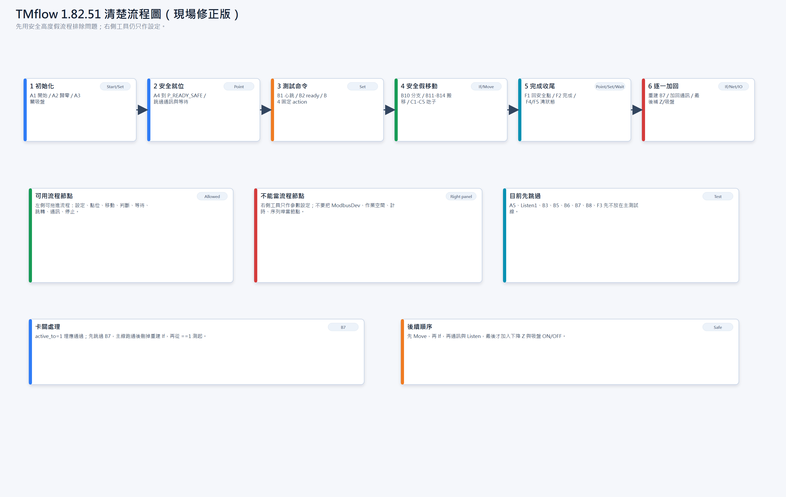
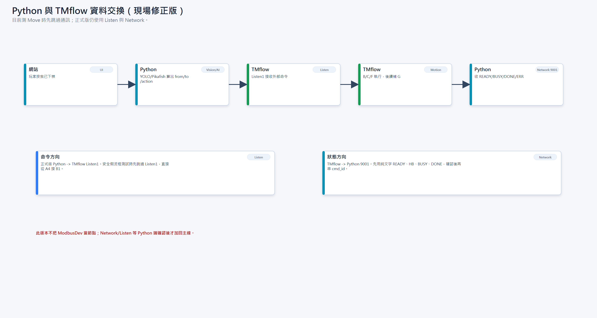

# TM Vision And Robot Runbook

本文件保留作 TMvision/EIH 與舊 Modbus 測試參考。2026-09-01 現場中文介面已確認右側 `ModbusDev` 不能當流程節點，只能設定參數；目前 TMflow 建節點請改看 `TMFLOW_1_82_51_FULL_NODE_DESIGN.md` 與 `TMFLOW_1_82_51_FIELD_OPERATION_MANUAL.md` 的左側節點版。不要再依本文件建立 `Modbus Read / Modbus Write` 流程節點。

Set-only 通過後，完整 Move、Point、吸盤、吃子區與子流程設計請接著看 `TMFLOW_1_82_51_FULL_NODE_DESIGN.md`。兩份文件不要混用：本文件用來縮小通訊測試問題範圍，完整動作版才用來建立真機移動流程。

## 圖片





同資料夾保留 SVG 版本，方便之後放大檢查或匯入其他文件。

## 0. 現場前提

目前你表示 Ethernet 可以連接到，文件因此不再保留「網路不通」作為現況結論。仍需在每次測試前確認：

```text
PC Ethernet IP = 192.168.10.50
Robot IP       = 192.168.10.10
Subnet mask    = 255.255.0.0
Flask          = 0.0.0.0:5000
TMflow ingest  = 0.0.0.0:9001, optional telemetry only
Modbus server  = 192.168.10.50:1502
```

Windows 防火牆需允許：

```text
5000  HTTP from TMvision/TMflow to Python
1502  TMflow Modbus client/master to Python Modbus server
9001  optional TMflow Network Node telemetry/status to Python
```

本次 Set-only 測試的必要通道只有 `5000` 與 `1502`。`9001` 只作選配觀測，不放進主要成敗判斷。

## 1. 啟動 Python

實驗室真機測試建議從 `.env.tmflow-real.example` 複製必要值，但先保持：

```env
APP_ENV=development
SYSTEM_MODE=lab_real_robot
AUTO_EXECUTE_ROBOT=false
```

啟動：

```powershell
.\.venv\Scripts\python.exe main.py
```

確認：

```text
http://192.168.10.50:5000/api/ready
```

若 TMvision 要從 robot 網段 POST 影像，Flask 不能只綁 `127.0.0.1`，必須使用：

```env
SMART_CHESS_BIND_ALL=1
SMART_CHESS_HOST=0.0.0.0
```

TMvision HTTP 目前需要 ingest key。若 TMvision 畫面支援 header，使用：

```text
X-TMflow-Vision-Key: <VISION_TMFLOW_INGEST_KEY>
```

若畫面只方便填 URL，先用 query string：

```text
?key=<VISION_TMFLOW_INGEST_KEY>
```

不要把本機 `.env` 的實際 key 寫進文件或截圖。

## 2. TMvision 節點設計

這是影像鏈路測試，不放進機械手臂 Modbus PollLoop。目的只確認 EIH/TMvision 的圖片能進 Python，後續才看 YOLO annotations。

建議建立兩個獨立的 TMvision 測試項目；它們不是 TMflow robot 子流程：

| 測試 | TMvision function | URL |
| --- | --- | --- |
| Classification ingress | External Classification | `http://192.168.10.50:5000/api/vision/tmvision/classify?key=<VISION_TMFLOW_INGEST_KEY>` |
| Detection parser | External Detection | `http://192.168.10.50:5000/api/vision/tmvision/detect?probe_box=1&key=<VISION_TMFLOW_INGEST_KEY>` |

External Classification 設定：

```text
Method: POST
Image source: EIH / built-in camera
Image format: jpg
Form field: file first, if needed try image
Timeout: 3000-5000 ms
```

成功回應：

```json
{
  "message": "success",
  "result": "frame_received",
  "score": 1.0
}
```

PC 端確認 snapshot：

```powershell
Invoke-WebRequest -Uri "http://127.0.0.1:5000/api/vision/snapshot" -OutFile "C:\tmp\tmvision_snapshot.jpg"
```

成功條件：

```text
C:\tmp\tmvision_snapshot.jpg 存在
檔案大小大於 0
影像內容是 EIH 相機畫面
```

External Detection 第一輪先使用 `probe_box=1`，因為它不依賴 YOLO，只驗證 TMvision 能不能解析 Python 回傳的 detection JSON：

```json
{
  "message": "success",
  "count": 1,
  "annotations_count": 1,
  "annotations": [
    {
      "label": "probe",
      "score": 0.99
    }
  ]
}
```

`probe_box=1` 通過後，改用真正 YOLO：

```text
http://192.168.10.50:5000/api/vision/tmvision/detect?key=<VISION_TMFLOW_INGEST_KEY>
```

若 HTTP 413 或 `image_too_large`，調高：

```env
MAX_REQUEST_BYTES=4194304
VISION_TMFLOW_IMAGE_MAX_MESSAGE_BYTES=4194304
```

## 3. TMflow Modbus Device

目前程式碼採用：

```text
Python PC = Modbus TCP server
TMflow    = Modbus TCP client/master
```

TMflow 1.82.51 建議建立一個 Modbus Device：

```text
Name: PC_MODBUS_1502
Protocol: Modbus TCP
Role: Client / Master
Server IP: 192.168.10.50
Server port: 1502
Unit ID: 1
Data type: 16-bit integer / word
Register type: Holding Register
Poll interval: 100 ms
Timeout: 1000 ms
Retry: 1 or 2
```

如果 TMflow 的 Modbus Device 設定畫面要先建立訊號或 channel，照下面命名；不同 TMflow build 的欄位名稱可能略有差異，但方向與 address 不要改：

| Channel name | Direction in TMflow | Function | Address | Type | Bind variable |
| --- | --- | --- | ---: | --- | --- |
| `CMD_FROM` | Read | Read Holding Register / FC03 | 0 | int16 | `from_square` |
| `CMD_TO` | Read | Read Holding Register / FC03 | 1 | int16 | `to_square` |
| `CMD_ACTION` | Read | Read Holding Register / FC03 | 2 | int16 | `action_type` |
| `CMD_ID` | Read | Read Holding Register / FC03 | 3 | int16 | `cmd_id` |
| `CMD_TRIGGER` | Read | Read Holding Register / FC03 | 4 | int16 | `trigger` |
| `FB_STATUS` | Write | Write Holding Register / FC06 or FC16 | 5 | int16 | `status` |
| `FB_ERROR` | Write | Write Holding Register / FC06 or FC16 | 6 | int16 | `error_code` |
| `FB_COMPLETED` | Write | Write Holding Register / FC06 or FC16 | 7 | int16 | `completed_cmd_id` |
| `FB_HEARTBEAT` | Write | Write Holding Register / FC06 or FC16 | 8 | int16 | `heartbeat` |
| `FB_ROBOT_STATE` | Write | Write Holding Register / FC06 or FC16 | 9 | int16 | `robot_state` |

位址要特別注意：目前 Python 設定是 `ROBOT_MODBUS_REGISTER_ADDRESSING=holding_40001`，也就是 Python 文件用 `40001`，但 Modbus protocol offset 是 `0`。Techman 官方 Modbus 範例也採用這個對應：40001 在 TMflow 端是 address 0。若 TMflow 畫面問的是 protocol address，請填 `0..9`；如果畫面問的是 holding register number，才填 `40001..40010`。不要兩種表示法混用。

Register map：

| Python register | Protocol offset | TMflow 方向 | TMflow 變數 | 說明 |
| ---: | ---: | --- | --- | --- |
| 40001 | 0 | Read | `from_square` | 來源格，0..89 |
| 40002 | 1 | Read | `to_square` | 目標格，0..89 |
| 40003 | 2 | Read | `action_type` | `0=move`, `1=capture`, `3=special` |
| 40004 | 3 | Read | `cmd_id` | 命令編號 |
| 40005 | 4 | Read | `trigger` | `1=有新命令`, `0=Python 已清除` |
| 40006 | 5 | Write | `status` | `0=Idle`, `1=Busy`, `2=Done`, `3=Error`, `4=Fault` |
| 40007 | 6 | Write | `error_code` | 本階段固定 0 |
| 40008 | 7 | Write | `completed_cmd_id` | 完成的命令編號 |
| 40009 | 8 | Write | `heartbeat` | 每輪加 1 |
| 40010 | 9 | Write | `robot_state` | 本階段用 `0=Idle`, `1=Busy` |

棋格編號：

```text
a0=0, b0=1, ... i0=8
a1=9, b1=10, ... i9=89
```

這個 Set-only 版本不使用 `from_square`、`to_square`、`action_type` 做動作判斷，只讀進來並完成握手。它的目的不是移動棋子，而是證明 Python 和 TMflow 對命令生命週期的理解一致。

## 4. TMflow 變數

在 TMflow project 建立下列全域變數或主流程變數，型別用 16-bit int 或一般整數即可：

| 變數 | 初始值 | 用途 |
| --- | ---: | --- |
| `from_square` | 0 | Modbus 讀入來源格 |
| `to_square` | 0 | Modbus 讀入目標格 |
| `action_type` | 0 | Modbus 讀入動作類型 |
| `cmd_id` | 0 | Modbus 讀入命令編號 |
| `trigger` | 0 | Modbus 讀入觸發值 |
| `status` | 0 | 寫回 Python 的命令狀態 |
| `error_code` | 0 | 寫回 Python 的錯誤碼，本階段固定 0 |
| `completed_cmd_id` | 0 | 寫回 Python 的完成命令 |
| `heartbeat` | 0 | 心跳計數 |
| `robot_state` | 0 | 手臂狀態摘要，本階段只用 Idle/Busy |
| `last_cmd_id` | 0 | 避免同一筆命令重複觸發 |
| `sim_delay_ms` | 500 | 模擬處理時間，讓 Python 看得到 Busy |

如果 TMflow 不能用 `sim_delay_ms` 變數餵給 Wait node，就在 Wait node 直接填 `500 ms`。

## 5. TMflow 1.82.51 Set-only 主流程

Project name 建議：

```text
SMART_CHESS_SET_ONLY_HANDSHAKE
```

主流程節點只需要這些：

| 順序 | 節點 | 類型 | 內部設定 |
| ---: | --- | --- | --- |
| 1 | `START` | Start | 無 |
| 2 | `SET_INIT` | Set | `from_square=0`, `to_square=0`, `action_type=0`, `cmd_id=0`, `trigger=0`, `status=0`, `error_code=0`, `completed_cmd_id=0`, `heartbeat=0`, `robot_state=0`, `last_cmd_id=0`, `sim_delay_ms=500` |
| 3 | `MB_WRITE_INIT` | Modbus Write | 寫 offset `5..9`：`status`, `error_code`, `completed_cmd_id`, `heartbeat`, `robot_state` |
| 4 | `WAIT_LOOP` | Wait | `100 ms` |
| 5 | `SET_HEARTBEAT` | Set | `heartbeat=heartbeat+1`; 若超過 32760 可設回 1 |
| 6 | `MB_WRITE_HEARTBEAT` | Modbus Write | 寫 offset `8`=`heartbeat`，offset `9`=`robot_state` |
| 7 | `MB_READ_COMMAND` | Modbus Read | 讀 offset `0..4` 到 `from_square`, `to_square`, `action_type`, `cmd_id`, `trigger` |
| 8 | `IF_NEW_COMMAND` | If | 條件：`trigger==1 AND cmd_id!=last_cmd_id` |
| 9 | `SET_BUSY` | Set | `status=1`, `error_code=0`, `robot_state=1`, `last_cmd_id=cmd_id` |
| 10 | `MB_WRITE_BUSY` | Modbus Write | 寫 offset `5`=`status`, offset `6`=`error_code`, offset `9`=`robot_state` |
| 11 | `WAIT_SIM_DONE` | Wait | `500 ms` |
| 12 | `SET_DONE` | Set | `status=2`, `completed_cmd_id=cmd_id`, `robot_state=0` |
| 13 | `MB_WRITE_DONE` | Modbus Write | 寫 offset `5`=`status`, offset `7`=`completed_cmd_id`, offset `8`=`heartbeat`, offset `9`=`robot_state` |
| 14 | `WAIT_CLEAR` | Wait | `100 ms` |
| 15 | `MB_READ_TRIGGER` | Modbus Read | 只讀 offset `4` 到 `trigger` |
| 16 | `IF_TRIGGER_CLEAR` | If | 條件：`trigger==0` |
| 17 | `SET_IDLE` | Set | `status=0`, `robot_state=0` |
| 18 | `MB_WRITE_IDLE` | Modbus Write | 寫 offset `5`=`status`, offset `9`=`robot_state` |

Modbus 節點內部欄位請照下列方式填：

| 節點 | Device | Operation | Start address | Quantity | Variable order |
| --- | --- | --- | ---: | ---: | --- |
| `MB_WRITE_INIT` | `PC_MODBUS_1502` | Write Multiple Holding Registers, or repeated single Write | 5 | 5 | `status`, `error_code`, `completed_cmd_id`, `heartbeat`, `robot_state` |
| `MB_WRITE_HEARTBEAT` | `PC_MODBUS_1502` | Write Single / Multiple Holding Register | 8 | 2 | `heartbeat`, `robot_state` |
| `MB_READ_COMMAND` | `PC_MODBUS_1502` | Read Holding Registers | 0 | 5 | `from_square`, `to_square`, `action_type`, `cmd_id`, `trigger` |
| `MB_WRITE_BUSY` | `PC_MODBUS_1502` | Write Single / Multiple Holding Register | 5 | 2 or split | `status`, `error_code`, plus `robot_state` at address 9 |
| `MB_WRITE_DONE` | `PC_MODBUS_1502` | Write Single / Multiple Holding Register | 5 and 7 | split if needed | `status`, `completed_cmd_id`, `heartbeat`, `robot_state` |
| `MB_READ_TRIGGER` | `PC_MODBUS_1502` | Read Holding Registers | 4 | 1 | `trigger` |
| `MB_WRITE_IDLE` | `PC_MODBUS_1502` | Write Single / Multiple Holding Register | 5 and 9 | split if needed | `status`, `robot_state` |

若 TMflow 1.82.51 畫面沒有「連續多筆寫入」或變數順序不好設，直接拆成多個單筆 Modbus Write node。這會增加節點數，但仍然在同一個主流程內，不需要副流程或子流程。拆法：

```text
MB_WRITE_BUSY_STATUS: address 5 = status
MB_WRITE_BUSY_ERROR: address 6 = error_code
MB_WRITE_BUSY_ROBOT_STATE: address 9 = robot_state

MB_WRITE_DONE_STATUS: address 5 = status
MB_WRITE_DONE_COMPLETED: address 7 = completed_cmd_id
MB_WRITE_DONE_HEARTBEAT: address 8 = heartbeat
MB_WRITE_DONE_ROBOT_STATE: address 9 = robot_state

MB_WRITE_IDLE_STATUS: address 5 = status
MB_WRITE_IDLE_ROBOT_STATE: address 9 = robot_state
```

流程線：

```text
START
  -> SET_INIT
  -> MB_WRITE_INIT
  -> WAIT_LOOP
  -> SET_HEARTBEAT
  -> MB_WRITE_HEARTBEAT
  -> MB_READ_COMMAND
  -> IF_NEW_COMMAND
       false -> WAIT_LOOP
       true  -> SET_BUSY
                 -> MB_WRITE_BUSY
                 -> WAIT_SIM_DONE
                 -> SET_DONE
                 -> MB_WRITE_DONE
                 -> WAIT_CLEAR
                 -> MB_READ_TRIGGER
                 -> IF_TRIGGER_CLEAR
                      false -> WAIT_CLEAR
                      true  -> SET_IDLE
                                -> MB_WRITE_IDLE
                                -> WAIT_LOOP
```

本階段不要加入：

```text
Move
PTP/Line
吸盤 DO
安全高度判斷
from/to/action range validation
吃子 dead zone
棋規 / FEN / AI
Listen Node 5890
高頻影像串流
```

這不是因為那些不重要，而是這次要先把 failure boundary 限縮到「Python 是否能送命令，TMflow 是否能回 Done」。只要加入 Move 或安全判斷，失敗時就很難判斷是通訊、點位、吸盤、姿態還是流程邏輯造成。

## 6. Python 端 Modbus 測試

先用獨立測試 server，不要一開始跑完整網站流程：

```powershell
.\.venv\Scripts\python.exe scripts\start_modbus_square_server.py --host 192.168.10.50 --port 1502 --watch --test-move a0b1
```

預期：

```text
Python writes command + trigger=1
TMflow reads from/to/action/cmd_id/trigger
TMflow writes status=1 Busy
TMflow writes status=2 Done
TMflow writes completed_cmd_id=cmd_id
Python clears trigger=0
TMflow writes status=0 Idle
```

成功條件：

```text
Python watch 視窗看得到 trigger 從 1 回到 0
status 至少出現 Busy 或 Done
completed_cmd_id 等於 cmd_id
同一個 test server 不重開，也能再測第二筆 --test-move
```

若 timeout：

```text
先查 TMflow 是否讀的是 offset 0..4
再查 TMflow 是否寫的是 offset 5..9
再查 TMflow Modbus Device IP/port 是否是 192.168.10.50:1502
最後才看 Python 程式
```

## 7. 9001 Network Node 選配

本次主流程不依賴 `9001`。如果要額外觀測 TMflow Network Node，先注意目前後端若設定了 `TMFLOW_INGEST_KEY`，簡單 CSV 例如 `HB,0` 會因為沒有 key 被拒收。

若 `TMFLOW_INGEST_KEY` 有值，Network Node 請送 JSON line。下面是內容形狀，`cmd_id`、pose 數值要用 TMflow 表達式轉成實際數字，不要把變數名稱當普通文字送出：

```text
"{\"key\":\"<TMFLOW_INGEST_KEY>\",\"event\":\"heartbeat\",\"robot_state_code\":0}" + Ctrl("\r\n")
"{\"key\":\"<TMFLOW_INGEST_KEY>\",\"status\":1,\"current_command_id\":" + GetString(cmd_id) + "}" + Ctrl("\r\n")
"{\"key\":\"<TMFLOW_INGEST_KEY>\",\"status\":2,\"completed_command_id\":" + GetString(cmd_id) + "}" + Ctrl("\r\n")
"{\"key\":\"<TMFLOW_INGEST_KEY>\",\"tcp\":[" + GetString(Robot[0].CoordBase, ",") + "]}" + Ctrl("\r\n")
```

如果只是實驗室快速測 `9001` 的連線，也可以暫時不設定 `TMFLOW_INGEST_KEY`，再用 CSV：

```text
HB,0
BUSY,1
DONE,1
CoordBase, x,y,z,rx,ry,rz
```

但不要同時期待「有 key」又「純 CSV 會通過」。

## 8. 啟用完整流程前完成條件

本文件目前只規劃 Set-only commissioning。它通過後，只能說：

```text
TMvision HTTP image ingress verified
TMvision External Detection JSON parser verified
Modbus square-command handshake verified
Robot motion not verified
Gripper not verified
Safety/motion nodes not verified
```

後續要真的移動棋子時，才恢復安全高度、點位、吸盤、吃子 dead zone、動作 timeout、實體急停等檢查，並且在那些通過前維持：

```env
AUTO_EXECUTE_ROBOT=false
```
